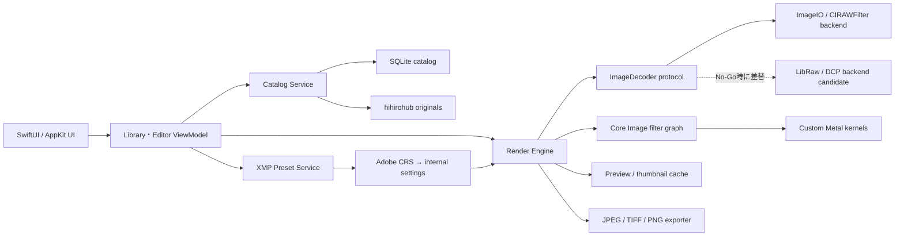

# Photo Bench（仮称）設計書

- 状態: Phase 0証跡基盤、P1 preview parity v3正式評価、原寸decode graphのMetal直接表示プロトタイプを実装。縮小decode候補は不採用。Metal経路はon-demandの3モードでpositive presentationを確認したが受入計測は未完了のためopt-in、既定は従来表示
- 対象: 自分専用のmacOSデスクトップアプリ
- 作成日: 2026-07-23
- 最終更新: 2026-07-24（JST）
- 設計優先度: 写真を壊さないこと > 色・階調・解像感 > Lightroom互換範囲 > 現像中の気持ちよさ > 実装量

## 1. 結論

実現可能。個人用・macOS限定・クラウドなしに絞ることで、Lightroomの主要体験をかなり小さなアプリにまとめられる。

推奨するのは、**SwiftUI + AppKit + Core Image/Metal + SQLite**によるネイティブmacOSアプリ。写真は`hihirohub`上の実ファイルを参照し、元画像には手を加えず、編集内容だけをカタログに保存する「非破壊編集」にする。

最初からLightroom全機能の再現を目指さず、契約終了のクリティカルパスに沿って次の順で作る。

1. Lightroom契約中に、機種・照明・補正を層別した教師書き出しと、原本・編集メタデータ・評価・アルバムの移行データを保全する
2. 編集の自動保存、SQLiteカタログ、評価・選別、埋め込みJPEGによる高速表示で「日常で使える最小ループ」を成立させる
3. WBレンダーとクロップを完成させ、不足する画質は追加教師で検証する
4. ブラシマスク、アルバム、検索、比較へ広げる

最大の注意点はXMPである。XMPは完成画像の色を定義するLUTではなく、Adobe Camera Raw向けの現像パラメータ群である。ファイルを解析することはできるが、Adobeの現像エンジン、カメラプロファイル、レンズプロファイルまで同じではないため、**Lightroomとピクセル単位で完全一致は保証しない**。ただしプロ用途を前提に、手元の実画像とLightroom基準書き出しを使った差分検証を導入し、対応項目については「雰囲気が近い」ではなく、実用上できる限り見分けにくい水準を目標にする。

### 1.1 現在の到達点

2026-07-24時点で、SwiftUIの3ペイン`.app`、JPEG/RW2読込、DC-S5機種限定RAW校正、8本の調整スライダー、4 XMPの解析、原寸sRGB JPEG出力、Lightroom TIFFとの差分測定まで実装済み。写真ルートはApp Sandbox内からユーザー選択し、security-scoped bookmarkで次回起動へ復元する。基本階調は`analytic-monotonic-hdr-basic-tone-v3`で、極端値でも有限・単調になるclean-room近似である。トーンカーブはencoded-sRGBの1D曲線とHDR端点外挿、カラーミキサーはOKLCh 8色バンドへ置き換えた。出力直前にmax-channel highlight shoulderと固定lightness / hueの色域圧縮を一度だけ適用し、途中のHDR値を0〜1へclampしない。HSL/curveは2基準画像だけでは業務品質を承認できないため初期OFFにしている。

P1では`interactive-preview`と`full-resolution`のdecode intent、原寸export guard、run archive、app-sideを含むsource fingerprint、強化したrelease benchmarkまで実装した。1つの`RenderEngine`内でもpreview / exportの`CIContext`を別instanceへ分離し、現スライスでは双方cache無効としている。manifest v2の直接2,560px RAW候補は履歴上不採用である。現行manifest v3では、原寸・3,072px・3,840px decodeへ同じ編集を施し、共通Lanczosで最終2,560pxへ揃えた2シーン×3段階の正式比較を行った。両縮小候補とも色差、EV、plateau純面積増加は全比較で合格したが、1px境界許容外の新規plateau面積が各3 / 6比較で上限を超えた。候補は選択せず、現表示は原寸decode経路を維持する。

その後、productionの原寸decode graphをCPU bitmapへ戻さず、`CIRenderDestination`からsRGB / SDR `MTKView`へ直接描画するプロトタイプを追加した。`PHOTO_BENCH_PREVIEW_ROUTE=metal-direct`の完全一致でのみopt-inし、既定はlegacyとする。黒レターボック付きaspect fit、1 in-flight + latest pending、expected-ID claim、window-level可視性、上限付き再描画、可視状態の10秒deadline、signpost / counter、その起動中の一方向fallbackを持つ。presentation lifecycleは純粋なreducerへ切り出し、request、surface visibility、再試行、deadline、callback競合、teardownを決定的に扱う。preview cacheはRSS・回収契約がない間`cacheIntermediates = false`とする。

性能証跡はbenchmark schema v3へ進み、tagged baselineのsource・binaryを固定した連続3正式runと、run / workload / process-fresh workerごとのsystem loadを保存する。source fingerprint `f8333be9f764af76b5d7e96d7a2967a44581405fca335fa27b1110f517f14e6b`の3 runでは、slider proxyが0 / 3、ほか3 workloadが3 / 3合格だった。負荷値でsampleを削除・再試行せず、単発passを製品採用の根拠にしない。この正式証跡は24 sourceを固定したtagged baselineのもので、現行branchのmanifest契約は26 sourceへ更新済みだが、校正とbenchmarkのformal rerunはまだ実施していない。

Metal直接表示のnative rasterは従来経路と全channel 1 LSB以内で一致し、queue / aspect fitも自動テストを通過した。LaunchServicesから通常のforeground `.app`として起動したon-demand smokeでは、`metal-clear`、`ci-solid`、`production`の3モードでpositive presentationを確認した。各起動の初回callbackは`presentedTime == 0`だったが、上限付き再試行で`presentedTime > 0`へ到達した。ここで`presentedTime`は絶対時刻であり、input-to-present latencyではない。productionでは写真選択と調整更新、window resize、約12秒のminimize後のresumeでも最新requestのpositive presentationを確認した。一方、actual-screen parity、input-to-present p95、drop率、rapid supersede時の一過性stale-frame、複数写真切替後の定常RSSは未承認である。このためdirect経路はopt-in、既定はlegacyを維持する。

編集状態は写真ごとにセッション内メモリへ保持するが、SQLite永続化、クロップ、ブラシ、アルバムはまだ設計段階である。したがって現行版は画質と技術選定を検証するプロトタイプであり、Lightroomから業務を移す完成版ではない。

### 1.2 画質ゲートの到達点

C1 shoulder修正後の最終レポートでは、P1524180 / P1522877のRAW・Lightroom入力計4経路すべてで、`full`の平均ΔEが`basic`より改善した（`7.592 → 6.796`、`5.556 → 4.835`、`5.858 → 3.341`、`5.468 → 3.417`）。complete clipとnear clipはbasic / fullともに全経路0、新規共有plateauも`0.00036 / 0.00037 / 0.00007 / 0.00017`で上限`0.0005`以内だった。

唯一の不合格はP1524180 / RAWの平均EV差である。basicの`+0.00376 EV`に対してfullが`+0.20779 EV`となり、許容上限`0.05376 EV`を超えた。他3経路のfull EV差は`+0.02628 / +0.00697 / -0.08396 EV`で各上限内に収まる。したがって安全性ゲートの大半は成立したが、全体判定は不合格であり、実験的HSL/curveの事業品質は未達とする。初期OFFを維持し、2シーンの結果を一般化しない。詳細は`CALIBRATION.md`と`.photobench/calibration/report.json`を正とする。

### 1.3 性能ゲートの到達点

tagged baselineではmanifest固定の24MP RAWをrelease build、warm各20回・process-fresh 40回で、同一source・binaryの正式runを直列に3回測定した。process-fresh p95は`960.77 / 369.03 / 575.27 ms`で3 / 3合格、warm exposure-perturbation engine proxyは`396.32 / 59.84 / 52.75 ms`で0 / 3合格、warm full-current-settings previewと原寸JPEGは3 / 3合格だった。これは画質不採用の直接2,560px実験engine経路であり、productionの原寸decode UIやinput-to-screenを測ったものではない。Metal直接表示はpositive presentationまで到達したが、絶対時刻の`presentedTime`からUI latencyを導けないため、実UI性能は依然として未評価である。正式証跡は24 sourceのtagged baselineに属し、26 source契約の現行branchではformal rerunしていない。測定契約と未計測範囲は`BENCHMARK.md`を正とする。

## 2. Goal

### 目的

`hihirohub`にある写真を、ネット接続やサブスクリプションなしで素早く選び、現像し、必要な形式へ書き出せる自分専用アプリを作る。

### 成功条件

- `hihirohub`上のフォルダを選ぶだけで写真を参照できる。
- 元画像を上書きせず、編集はいつでも戻せる。
- 露出や色のスライダーを動かしている間、プレビューが連続して追従する。
- `niho-priset_colorful.xmp`を読み込み、対応項目と未対応項目を確認して適用できる。
- クロップとブラシ部分補正を、専門知識なしにやり直せる。
- 仮想アルバムを作って、実ファイルを移動せず写真を整理できる。
- SSDが未接続でも、写真消失やカタログ破損と誤認させない。
- 17,000枚規模のカタログを扱い、選別作業で約897GBから約500GBへ絞り込める。
- Lumix RAWとJPEGの両方で、肌色、ハイライト、暗部、細部の解像感を仕事用途に耐える品質で維持する。

### 非目標

- Lightroomとの完全な機能・画質互換
- Adobe Camera Rawのピクセル単位の再現
- クラウド保存、同期、共有、共同編集
- AIマスク、生成AI、顔認識、被写体認識
- iPhone/iPad/Windows対応
- 動画編集
- プラグイン市場、他ユーザー向け配布、App Store公開

## 3. 前提と未確定事項

確認済みの前提は以下。

- Apple Silicon Macでのみ使う。
- macOS 14以降を対象にする。
- JPEGとRAWの利用比率はおよそ半々で、両方を正式対応にする。
- メインカメラはLumix。検証RAWはPanasonic DC-S5のRW2、6000×4000、14bit。
- 検証JPEGはSony ILCE-7M2のJPEG、6000×4000、8bit sRGBも含む。
- Lightroom上の現状規模は約897GB・17,000枚。Cloud版かClassicかは未確認であり、選別後は約500GBを目標にする。
- 初期開発中はこの`NIHO/others/photo`を読込・保存ルートにする。
- 完成後はユーザーが選ぶローカルまたは外付けストレージ上の任意フォルダを読込・保存ルートにする。
- Lightroomと似た操作配置は採用するが、アイコン、固有アセット、名称をそのまま複製しない。
- XMPはLightroomに極力近い色を目指し、未対応項目は黙って無視せず表示する。

完成判断までに確認したい事項は「14. Open questions」にまとめる。

## 4. Current system

現在このフォルダには、macOSプロトタイプ、Process Version 11のXMP 4個、Lumix DC-S5のRW2 3枚、Sony ILCE-7M2のJPEG 3枚がある。うちRW2 2枚には、Lightroomの適用前/`colorful`適用後16bit sRGB TIFFが揃っている。

このXMPには、主に次の項目が含まれている。

- 基本補正: 露出、コントラスト、ハイライト、シャドウ、白レベル、黒レベル
- 色: 自然な彩度、彩度
- HSL: Red / Orange / Yellow / Green / Aqua / Blue / Purple / Magentaの色相・彩度・輝度
- トーンカーブ: 全体、Red、Green、Blue
- ディテール: シャープ、カラーノイズ低減
- レンズ: 色収差補正、レンズプロファイル
- プロファイル: Adobe Color

現在は基本8項目を解析・近似適用し、WB値を構造化して保持する。HSLとトーンカーブは任意適用できるが未校正のため初期OFF。Adobe Color、レンズプロファイル、Adobe固有のノイズ低減は、初期版では完全再現の対象外とする。

## 5. User journey

### 5.1 初回起動

1. アプリを起動する。
2. 「写真フォルダを選ぶ」で`hihirohub`上のルートを選ぶ。
3. アプリが対応画像だけを走査し、サムネイルを生成する。
4. 必要なら手元のXMPプリセットを読み込む。
5. 最近追加した写真のグリッドを表示する。

初回から空の複雑なカタログ画面を見せず、「フォルダを選ぶ」1操作から始める。
固定パスの自動走査は行わない。選択したURLはsecurity-scoped bookmarkとして保存し、次回起動ではUIを出さずに復元する。bookmarkが破損・失効した場合は黙って別パスへfallbackせず、再選択を求める。外付けSSDが未接続なだけの場合はbookmarkを消さない。

### 5.2 日常の編集

1. 左のフォルダまたはアルバムを選ぶ。
2. 中央のグリッドから写真をダブルクリックする。
3. 中央に大きなプレビュー、下にフィルムストリップ、右に編集パネルを表示する。
4. プリセットを選ぶ、またはスライダーで調整する。
5. 必要ならクロップ、ブラシマスクを追加する。
6. `\`キーまたは長押しでBefore/Afterを確認する。
7. 「書き出す」でJPEG等を別ファイルとして保存する。

編集内容は操作ごとに自動保存する。明示的な「保存」は不要で、書き出しだけを明確な操作にする。

### 5.3 アルバム整理

1. 左ペインの「アルバムを追加」を押す。
2. 名前を付ける。
3. 写真をドラッグ、または選択して追加する。

アルバムは仮想コレクションであり、原本のファイル移動や複製を行わない。同じ写真を複数アルバムへ入れられる。

### 5.4 SSDが見つからない場合

- 通常画面の代わりに「hihirohubを接続してください」を表示する。
- 「再接続」「別の場所を指定」を用意する。
- 見つからない写真を削除扱いにしない。
- SSDの再接続後は同じカタログを自動的に復旧する。

### 5.5 失敗時の復帰

- 読めない画像: 一覧には警告付きで残し、原因とファイル位置を表示する。
- XMPの未知項目: 適用前に「対応 / 近似 / 未対応」を一覧表示する。
- 書き出し失敗: 元画像と編集状態を維持し、保存先変更と再試行を提示する。
- 外部でファイルが移動された: 名前、サイズ、撮影日時、指紋から候補を探し、再リンクできるようにする。
- アプリ終了やクラッシュ: 最後に確定した操作まで自動復旧する。

## 6. UX設計

### 6.1 基本レイアウト

Lightroomに慣れた操作感を活かしつつ、個人用途に不要な機能を除いた3ペイン構成にする。

```text
┌──────────────────────────────────────────────────────────────────────────────┐
│ 戻る  Library / Edit             写真名・撮影日            Before  書き出す │
├───────────────┬─────────────────────────────────────┬────────────────────────┤
│ フォルダ       │                                     │ 編集                   │
│  hihirohub     │                                     │ プリセット             │
│  2026          │             写真プレビュー           │ ライト                 │
│               │                                     │  露出 ─────●──        │
│ アルバム       │                                     │  コントラスト ─●──     │
│  お気に入り    │                                     │ カラー                 │
│  鎌倉          │                                     │  色温度 ───●──        │
│               │                                     │ マスク / クロップ      │
├───────────────┴─────────────────────────────────────┴────────────────────────┤
│            フィルムストリップ:  □  □  □  □  □  □                           │
└──────────────────────────────────────────────────────────────────────────────┘
```

### 6.2 画面構成

#### Library

- 左: フォルダ、アルバム、最近追加、お気に入り
- 中央: 日付単位の写真グリッド
- 上: 検索、並び順、表示サイズ
- 下: 選択枚数と簡易評価

#### Edit

- 中央: 最大化した写真プレビュー
- 下: 同じフォルダ/アルバムのフィルムストリップ
- 右: プリセットと編集セクション
- 右端ツール: 編集、クロップ、マスク

右パネルは「ライト」「カラー」「カーブ」「カラーミキサー」「効果」の順。最初はライトとカラーを開き、ほかは折りたたむ。

### 6.3 操作原則

- スライダーはドラッグ、クリック、矢印キー、数値直接入力に対応する。
- スライダー名をダブルクリックすると既定値へ戻る。
- セクション単位で有効/無効を切り替え、差を確認できる。
- すべての編集を`⌘Z` / `⇧⌘Z`で戻す・やり直す。
- プリセット適用後も各値を通常のスライダーとして編集できる。
- プリセットを重ねる場合は、原則「最後のプリセットで対象項目を置換」し、何が変わるかを適用前に示す。
- 選択中写真を変えても、未保存ダイアログは出さない。編集は自動保存する。
- UIはダークテーマを既定にする。写真の見え方を邪魔しない中立グレーを使う。

### 6.4 クロップ

- 自由比率、元画像、1:1、4:3、3:2、16:9を用意する。
- 三分割グリッドを表示する。
- Enterで確定、Escで操作開始前へ戻す。
- クロップは非破壊で、後から何度でも変更できる。
- 90度回転はMVPに含め、細かな傾き補正は次段階とする。

### 6.5 ブラシマスク

- 写真上をなぞってマスクを作る。
- ブラシサイズ、ぼかし、流量、消去を用意する。
- 赤いオーバーレイで選択範囲を表示できる。
- 1枚に複数マスクを作れ、名前を変更できる。
- マスクごとに露出、コントラスト、ハイライト、シャドウ、色温度、色かぶり、彩度を調整できる。
- 1ストローク単位でUndoできる。
- AIによる被写体・空・人物選択は扱わない。

## 7. Options

### A. ネイティブmacOS: SwiftUI + AppKit + Core Image/Metal（推奨）

**長所**

- Apple SiliconのGPUを素直に使え、スライダー追従を作りやすい。
- `CIRAWFilter`でmacOS対応RAWを扱える。
- ColorSync/Core Imageのカラーマネジメントを利用できる。
- ファイル選択、外部SSD、キーボード操作などmacOSとの統合が自然。
- 個人用`.app`として配布基盤なしで動かせる。

**短所**

- macOS専用になる。
- Lightroom独自の現像演算は自前のMetal/Core Imageフィルターが必要。
- 高機能な画像キャンバスはSwiftUIだけでなくAppKit/Metalビューの併用が必要。

### B. Tauri + React + Rust + libvips/LibRaw

**長所**

- Web技術でUIを高速に作れる。
- Rust側で画像処理とファイル管理を分離できる。
- 将来Windowsへ広げやすい。

**短所**

- WebViewとGPU画像表示の境界が複雑になる。
- macOSの色管理、RAW、外部ディスク権限を別々に組み込む必要がある。
- 個人用macOS限定という条件では、クロスプラットフォームの複雑さが見返りに合わない。

### C. darktable / RawTherapeeをベースに改造

**長所**

- RAW現像、マスク、履歴などのエンジンが既にある。
- 高度な現像品質へ近づくのは早い。

**短所**

- 大規模コードベースの理解と保守が必要。
- UIを自分向けに単純化する変更が重い。
- Lightroom XMPと処理モデルが同じではない。
- 「自分が欲しい小さなアプリ」より「既存大型アプリのフォーク」になりやすい。

### Recommendation

AをUI・アプリ基盤として採用する。ただしRAW現像は`ImageDecoder`プロトコルの後ろへ隔離し、Core Imageを確定エンジンとはみなさない。Phase 0でCIRAWFilterとLightroom基準を比較し、色差ゲートを満たさない場合は、UIを捨てずにLibRaw + DCP対応パイプラインへ差し替える。

## 8. 技術アーキテクチャ



### 8.1 推奨技術

- 言語: Swift 6
- UI: SwiftUI、必要箇所だけAppKit
- 画像表示: `MTKView`またはCore Imageを描画する専用`NSView`
- 画像処理: Core Image + Metal custom kernel
- RAW: 初期backendは`CIRAWFilter`。`ImageDecoder`境界を通し、確定前提にしない
- メタデータ: ImageIO / CGImageSource
- カラーマネジメント: ColorSync / `CGColorSpace`
- カタログ: SQLite（GRDB等を薄いRepository層の内側で利用可能）
- ファイル監視: 初期版は手動再スキャン、後にFSEvents
- XML: Foundation `XMLParser`。XMPのCamera Raw namespaceだけを明示的に読む
- テスト: Swift TestingまたはXCTest + ゴールデン画像比較

### 8.2 モジュール構成案

```text
photo/
├── Package.swift
├── Sources/PhotoBenchApp/
│   ├── App/
│   ├── Library/
│   ├── Editor/
│   ├── Presets/
│   ├── Export/
│   └── UIComponents/
├── Sources/PhotoCore/
│   ├── Catalog/
│   ├── FileAccess/
│   ├── ImageMetadata/
│   ├── PresetXMP/
│   ├── RenderEngine/
│   ├── Adjustments/
│   ├── Masks/
│   └── Shaders/
├── Tests/
│   ├── PhotoCoreTests/
│   ├── PresetCompatibilityTests/
│   └── RenderGoldenTests/
├── Fixtures/
└── docs/
```

UIと画像処理を別ターゲットにし、スライダーの見た目を触る作業と現像結果を触る作業を分離する。

## 9. 非破壊編集とレンダリング

### 9.1 原則

- 原本は読み取り専用として扱い、上書きしない。
- **現行:** 編集値は写真IDごとにセッション内メモリへ保持し、アプリ終了で消える。
- **Phase 1目標:** 編集値を写真ごとのversioned JSONとしてSQLiteへ自動保存する。
- **Phase 1目標:** Undo/Redoはセッション内スタックに保持し、確定状態だけを永続化する。永続履歴テーブルは必要性を確認してから追加する。
- プレビューと書き出しは同じ編集モデルから生成する。
- プレビューの最終表示は表示解像度、書き出しは原寸で再レンダリングする。現行production RAWはfull-resolution decode後に表示寸法へrender / downscaleし、RAW自体を縮小decodeする`scaleFactor`候補はparity v3不合格のため未接続とする。
- RAW native寸法は正の有限整数として検証し、0・非有限・不明なら整数化前にfail closedとする。exportは実image extentも非有限・非正・原寸不一致なら拒否する。
- 1つの`RenderEngine`はpreview / export用に別々の`CIContext`を保持し、現段階は双方`cacheIntermediates = false`とする。preview cache有効化は性能改善の仮説であり、メモリ上限・eviction・写真切替後の定常RSS gateと同じスライスでのみ評価する。
- 既定の表示はCIImageをCPU bitmapへmaterializeするlegacy経路。実験的Metal直接経路は起動環境変数`PHOTO_BENCH_PREVIEW_ROUTE=metal-direct`の完全一致でのみ使い、通常起動へ影響させない。
- Metal直接経路はsRGB / SDR、pixel formatは`.bgra8Unorm`、黒レターボック付きaspect fitに固定する。1件のin-flightと最新pendingのみを保持し、expected request IDと一致する場合だけpendingをclaimする。
- request、surface visibility、再試行、deadline、callback競合、teardownはUIから分離した純粋な`DirectPreviewLifecycle` reducerへ入力し、completionはtoken単位でexactly onceにclaimする。window / application notificationはsurface eventへ正規化する。
- 不可視・miniaturized / occluded時はdeadlineと再試行を停め、window-levelで可視になったら再開する。nil drawableは上限付きbackoffで再試行し、可視な最新requestが10秒以内にpositive presentationしなければ、その起動中はlegacyへ一方向fallbackする。
- `PreviewDrawRequested` / `PreviewDrawStarted` / `PreviewGPUCompleted`等のsignpostとカウンタを診断に使う。GPU completionと実画面presentは別の事実とし、`presentedTime > 0`なしに提示成功と判定しない。

### 9.2 パイプライン

```mermaid
flowchart LR
    A["原本"] --> B["RAW decode / ImageIO"]
    B --> C["向き補正・extended linear sRGB"]
    C --> D["露出"]
    D --> E["単調な基本階調"]
    E --> F["encoded-sRGB 1D curve（任意）"]
    F --> G["OKLCh 8-band mixer（任意）"]
    G --> H["自然な彩度 / 彩度"]
    H -. "Phase 2以降" .-> I["部分補正・クロップ"]
    I --> J["max-channel shoulder"]
    J --> K["固定L/h OKLCh色域圧縮"]
    K --> L["sRGB表示 / export"]
```



- 現行`CIContext`の作業空間はextended linear sRGBで、0未満と1超の値を保持する。基本階調は輝度だけをencoded-sRGBへ写して操作し、トーンカーブもXMP点列の意味に合わせて各channelをencoded-sRGBへ往復するため、「全処理がscene-linear」ではない。
- 現行の画面、JPEG、比較TIFFはsRGB。ディスプレイプロファイル尊重とDisplay P3出力は完成形の目標であり未検証。
- トーンカーブは0〜1内部を区分線形補間し、その外側を有限な正の端点傾きで外挿する。OKLCh mixerもHDR・負値を途中でclampせず、色域への収容は最終output nodeへ一元化する。
- XMP HSL LuminanceはOKLabの斉次性を使い、バンド中心かつ相対chroma `>= 0.08`で`+100 = +1 EV`となるRGB局所露光として定義する。near-neutralではguardが効果量を下げる。これはAdobe HSL Luminanceの再現ではない。HSL Luminance `+25`、Saturation `+100`、S字curveはそれぞれ独立CPU fixtureで寄与を固定し、画像レベルのEV gateをスライダー意味論で補正して緩めない。
- 後段の自然な彩度`CIVibrance`と彩度`CIColorControls`はextended-linear作業空間で使うが、HDR域の内部数式はAppleの公開契約ではない。現sliceではブラックボックスとして明記し、暗黙clipの有無を追加実写と将来の独自Metal kernelで検証する。
- 最終output nodeは最大channel比を保つhighlight shoulderの後、OKLChでlightnessとhueを固定してchromaだけをsRGB境界へ圧縮する。shoulderは`knee = 0.99`、`ceiling = 0.998`、`softness = 0.008`で値と一次微分が連続するC1接続とする。bounded sRGB rasterかつカラー編集がneutralならこのnodeをbypassし、読み込んだJPEG等を不要に再マッピングしない。
- 色域圧縮のCPU参照は倍精度で厳格な単調性を検証する。RGBAfの実レンダーは、LMSゼロ近傍で単精度条件が悪化するため、`C/Cmax <= 2`の運用域と`<= 4`のstress域を分け、67,368点のΔEOK・L・色相・最大彩度逆行・boundednessで検証する。閾値は編集controlの最大倍率と[W3C CSS Color 4のΔEOK](https://www.w3.org/TR/css-color-4/#deltaEOK)から導き、2実写へfitしない。
- RAWはMake/ModelがPanasonic DC-S5に一致しRAW 8を使える場合だけ`panasonic-dc-s5-lightroom-9.3-edr1-v2`（boost 0.9 / EDR 1）を選ぶ。他機種はgeneric未校正profileで、DC-S5値を流用しない。
- 初期の書き出し既定値はsRGB JPEG、品質92、元サイズ。
- RAWデコーダのバージョンはカタログへ記録し、OS更新後に見た目が変わり得ることを検知できるようにする。

### 9.3 スライダーの初期範囲

| 項目 | UI範囲 | 内部表現 | 備考 |
|---|---:|---|---|
| 露出 | -5〜+5 EV | Float | XMP `Exposure2012` |
| コントラスト | -100〜+100 | Float | 中間調中心 |
| ハイライト | -100〜+100 | Float | 高輝度域のロールオフ |
| シャドウ | -100〜+100 | Float | 低輝度域 |
| 白レベル | -100〜+100 | Float | 白点近傍 |
| 黒レベル | -100〜+100 | Float | 黒点近傍 |
| 色温度 | 2,000〜50,000K | Float | RAWと非RAWで基準値を分ける |
| 色かぶり | -150〜+150 | Float | 緑↔マゼンタ |
| 自然な彩度 | -100〜+100 | Float | 低彩度色を優先 |
| 彩度 | -100〜+100 | Float | 全体彩度 |

露出は`CIExposureAdjust`、コントラスト・ハイライト・シャドウ・白・黒は独自基本階調カーネル、自然な彩度と彩度はCore Image標準フィルターで処理する。独自階調`analytic-monotonic-hdr-basic-tone-v3`はtoe、bounded midtone warp、shoulder、pivoted contrast、HDR shoulderを組み合わせ、共通RGBゲインとして適用する。Adobe PV2012の数式再現ではなく、2画像で暫定検証したclean-room近似である。

現行の実行時CIKLはdeprecated APIを使うため、画質校正とは分けた専用スライスでパッケージ済みMetal Core Image kernelへ移す。移行前後のCPU/GPUランプとLightroom TIFF出力を一致させ、kernel欠落時に補正を黙ってスキップしないことを受け入れ条件にする。

### 9.4 マスクの保存方式

マスク画像そのものだけを保存せず、ブラシストロークをベクターデータとして保存する。

```text
Mask
  id
  name
  adjustments
  strokes[]
    mode: paint | erase
    points[]: normalized x, y, pressure
    size
    feather
    flow
```

プレビュー時は低解像度のマスクキャッシュを生成し、書き出し時は同じストロークを原寸へ再ラスタライズする。これにより、プレビュー用マスクを拡大して輪郭が荒れる問題を避ける。

マスク座標は、EXIF向き補正後・クロップ前の画像に対する0〜1の正規化座標で保持する。クロップ変更後も塗った位置がずれない。

## 10. XMP互換設計

### 10.1 方針

1. XMP原文をそのままカタログへ保持する。
2. `crs` namespaceの既知項目を内部`EditSettings`へ変換する。
3. 各項目を`exact / approximate / unsupported`に分類する。
4. 未知項目や範囲外値を黙って捨てず、読み込み結果に表示する。
5. `ProcessVersion`と`Version`を記録し、将来のマッピング変更に備える。
6. プリセット適用は1操作としてUndoできる。

### 10.2 手元プリセットの対応表

| XMP要素 | 初期対応 | 方針 |
|---|---|---|
| Exposure / Contrast | 近似 | 独自基本補正カーネルへ変換 |
| Highlights / Shadows | 近似 | 輝度レンジ別の補正 |
| Whites / Blacks | 近似 | 白点・黒点近傍の補正 |
| Vibrance / Saturation | 近似 | 内部カラー補正へ変換 |
| ToneCurvePV2012 | 近似・初期OFF | encoded-sRGBの1D区分線形曲線。0〜1外は正の端点傾きで外挿 |
| ToneCurve Red/Green/Blue | 近似・初期OFF | 各channel curveの後にglobal curveを適用。3D LUTは使わない |
| HSL Hue/Saturation/Luminance | 近似・初期OFF | OKLChの8色バンド補間。相対chromaで低彩度を保護。効果量100%時のLuminanceは`+100 = +1 EV`の局所露光 |
| WhiteBalance | 値保持・未適用 | As Shot / Custom、絶対値、増分値、明示的0を保持。XMP WBのレンダーは未実装 |
| Sharpness | 後続 | Adobeと異なるため初期は警告 |
| ColorNoiseReduction | 後続 | 初期は未対応表示 |
| LensProfileEnable | 未対応 | AdobeレンズDBを持たない |
| AutoLateralCA | 後続候補 | Core Image RAW対応可否を機種ごとに確認 |
| Look: Adobe Color | 未対応 | Adobeプロファイルを再現しない |

近似項目はAdobeと同じ数値結果を保証しない。curveは各linear RGB channelをencoded-sRGBへ変換し、channel curveの後にglobal curveを適用してlinearへ戻す。author pointは0〜1へ正規化し、重複xはXMP順の後勝ちで決定してから並べ、端点外は最後のsegment傾きを`0.01...4.0`へ制限して外挿するため、HDRハイライトを一定値へ潰さない。mixerはOKLCh上で8色バンドを環状補間し、相対chroma `0.02...0.08`のsmoothstepでnear-neutralへの効果を抑える。LuminanceはL/a/bを同率で拡大し、linear RGBでは`2^(adjustment/100)`の局所露光になる。両者ともCPU式とCI kernelを同じ仕様にし、kernelを入力値ごとにcacheする。Adobe PV2012の内部作業空間・プロファイル・処理順とは異なるため、初期OFFとする。

### 10.3 XMP受け入れ条件

`niho-priset_colorful.xmp`と追加3プリセットについて、次を自動テスト済み。

- 名前`niho-priset_colorful`を取得できる。
- ProcessVersion 11.0、Camera Raw Version 17.0を取得できる。
- MVP対象の基本補正8項目（露出、コントラスト、ハイライト、シャドウ、白、黒、自然な彩度、彩度）を欠落なく読み込める。
- 初期値が0のTexture、Clarity、Dehazeも認識し、未対応項目として誤魔化さず報告できる。
- 全体とRGBの4本のトーンカーブを読み込める。
- 8色×H/S/Lの値を読み込める。
- 未対応のAdobe Color、レンズ補正、ノイズ低減を報告できる。
- 範囲外値をUI範囲へclampし、NaN/Infinityを採用しない。
- 旧`EditSettings` JSONを新フィールドの既定値付きで復元できる。

プリセット適用を1操作でUndoする機能はPhase 1の受け入れ条件で、まだ未実装。

## 11. カタログとファイル管理

### 11.1 推奨保存場所

```text
/Volumes/PhotoLibrary/
├── Photos/                         # 原本。既存構成を尊重
└── .photobench/
    ├── catalog.sqlite
    ├── thumbnails/
    ├── previews/
    ├── mask-cache/
    └── backups/
```

カタログ本体はMac側のApplication Supportへ置き、SSD側へ安全なバックアップを保存する。これによりSSDが一時的に外れても、評価、アルバム、直前までの編集状態を失わない。原本が必要な編集・書き出しはSSD再接続まで無効にする。

開発中だけは可視性を優先し、repository rootの`.photobench`をカタログ・キャッシュ置き場、`exports`を書き出し先にする。完成版ではMac側のApplication Supportを主カタログ、ユーザーが選んだ外付け写真ルート配下の`.photobench/backups`をバックアップ先にする。既存の写真フォルダ構成は勝手に変更しない。

### 11.2 macOSファイル権限と署名

- App Sandbox、user-selected read/write、app-scoped bookmarksを有効にする。
- 初回は`NSOpenPanel`でフォルダを明示選択し、隠れたDocumentsアクセスや起動時の固定パス走査を行わない。
- Panelが暗黙に開始したsecurity scopeと、bookmark復元後に明示開始したscopeを区別し、全終了経路で一度だけ`stopAccessingSecurityScopedResource()`する。
- bookmark解決はUI表示と未接続volumeの自動mountを禁止する。SSD不在は削除扱いにせず、capabilityを保持したまま「再接続または別の場所を指定」と表示する。
- 現在のローカルbuildはApp Sandbox付きad-hoc署名。別組織のApple Development証明書は使わない。再ビルドでdesignated requirementが変わり、再選択が必要になる可能性を許容する。将来はユーザー自身の署名identityを明示設定した場合だけ安定署名へ切り替える。

### 11.3 主なデータモデル

| テーブル | 主な内容 |
|---|---|
| `assets` | UUID、相対パス、volume UUID、ファイル指紋、撮影日時、寸法、形式、評価 |
| `folders` | 参照フォルダ、表示名、最終走査時刻 |
| `albums` | 仮想アルバム名、並び順 |
| `album_assets` | アルバムと写真の関連、アルバム内順序 |
| `edits` | 写真UUID、編集JSON、schema version、更新日時 |
| `presets` | 名前、XMP原文、変換済み設定、互換性レポート |
| `masks` | 写真UUID、マスク名、ストローク、部分補正値 |
| `history` | 後続候補。初期版では作らず、セッション内Undoを使用 |

初期版はvolume UUIDとSSDルートからの相対パスを正とする。部分ハッシュは17,000枚での初回走査コストと連写時の衝突率を実測した後、再リンク機能と一緒に導入する。

### 11.4 バックアップ

- アプリ終了時または一定操作数ごとにSQLiteの安全なスナップショットをSSD内へ作る。
- 世代数を固定し、古いものから置き換える。
- 原本バックアップはアプリの責務外。ただし初回に「このアプリは原本のバックアップを作らない」と明示する。
- SSDが外れた場合も評価・アルバム・既存編集値はMac側カタログへ保存できる。原本が必要な新規編集・書き出しは再接続まで無効にし、成功と誤表示しない。

## 12. 性能目標

完成形の目安とengine baseline、実験候補を分けて管理する。Mac16,10 / Apple M4 / macOS 26.3.1、manifest既定24MP RAW、release buildでの比較は次のとおり。baselineはwarm各20回、tagged baselineの正式runはwarm各20回・process-fresh 40回で、同じsource / binaryを固定して直列に3回測定した。

| engine workload | baseline p95 | run 1 p95 | run 2 p95 | run 3 p95 | gate | 合格回数 |
|---|---:|---:|---:|---:|---:|---:|
| process-fresh tone engine preview | 940.75 ms | 960.77 ms | 369.03 ms | 575.27 ms | ≤ 1,000 ms | 3 / 3 |
| warm exposure-perturbation engine proxy | 131.17 ms | 396.32 ms | 59.84 ms | 52.75 ms | ≤ 50 ms | 0 / 3 |
| warm full-current-settings engine preview | 138.41 ms | 131.20 ms | 61.84 ms | 55.60 ms | ≤ 300 ms | 3 / 3 |
| 原寸JPEG quality 0.92 | 208.86 ms | 1188.77 ms | 234.51 ms | 223.04 ms | ≤ 3,000 ms | 3 / 3 |

benchmark schema v3はrun / workload境界と40個のprocess-fresh workerの開始・終了に、1 / 5 / 15分load average、1分load / active processor、thermal、Low Power Mode、process CPU time、Metal確保量を記録する。取得不能・非有限値はfail closedだが、loadは診断専用であり、値を理由にsampleを削除・再試行・gate除外しない。tagged baselineの3 runは`44b4c41e-e18b-4cdd-9720-4c121a365fbd`、`9bd69010-e2e7-4a57-ac2c-bd0e3d04e18f`、`f9024302-f48c-4f62-bd84-589013696861`で、最新runもslider gateが不合格である。

manifest v3の3,072 / 3,840px候補も1px許容外plateau gateにより両方不採用である。原寸full-decode graphのMetal直接描画ではon-demandの`metal-clear`、`ci-solid`、`production`でpositive presentationへ到達し、写真選択・調整更新・resize・minimize/resumeでも最新requestの提示を確認した。初回callbackの`presentedTime == 0`は上限付き再試行で回復したが、`presentedTime`は絶対時刻でありlatency値ではない。actual-screen parity、input-to-present p95、drop率、rapid supersede時のstale-frame、複数写真後の定常RSSが未承認なので、既定はlegacyを維持する。次のMetal作業はこれらの受入計測に限定し、合格しない限りdefaultを切り替えない。`cacheIntermediates = true`、draft / settle二層化、100% detail windowはそれぞれ別の受入条件とRSS / 知覚契約が必要な仮説であり、現時点の採用仕様ではない。実行時CIKLのpackaged Metal化は保守課題として残るが、wall-clockだけで最初のボトルネックと断定しない。

以下のproduct targetは、engine benchmarkではまだ証明していない。

- キャッシュ済みサムネイルのグリッド表示: 500枚の一覧でスクロール落ちを体感させない。
- 写真を開く: キャッシュあり300ms以内、キャッシュなし1秒以内にまず低解像度を表示。
- スライダー操作: 入力から画面反映までp95で50ms以下、操作停止後に高品質へ更新。
- 24MP JPEG書き出し: 品質92で3秒以内を目標とし、UIをブロックしない。
- 17,000枚・500GB規模: 全画像をメモリへ持たず、DBページングとオンデマンドキャッシュを使う。
- カタログ起動: 2秒以内。17,000枚の初回サムネイル生成は30分以内を暫定目標にする。

スライダーのドラッグ中に最終表示を最大2,560px程度へ抑えることは目標だが、現productionはRAW自体を原寸decodeする。RAW縮小を再採用する場合は新しいparity契約を通す。大量の連続入力は古いレンダリングをキャンセルし、最新値だけを描く。最終合格はengine wall-clockではなく、実UIのinput-to-screen、drop frame、高品質settleをInstruments signpostで測って判定する。

## 13. 実装ロードマップ

### Phase 0: 技術スパイク（進行中）

#### Spike A: RAW基礎色とデコーダ選定

- macOS `.app`の最小構成
- Lumix DC-S5のRW2を14bit RAWとしてデコードし、埋め込みJPEGではなく現像結果を表示
- CIRAWFilter出力、RAW埋め込みJPEG、LightroomのAdobe Color / As Shot基準を同条件で比較
- RAW decoder version、macOS、Lightroom/ACR versionを基準結果へ記録
- 色差、肌色、ハイライトクリップ、暗部、細部の解像感を測る

**Go条件:** 5〜10枚のLightroom基準に対し、中央値ΔE00 ≤ 3.0、95 percentile ≤ 6.0、肌色領域≤ 2.5、ハイライトクリップ点差≤ 0.2EVを暫定基準とする。3枚以上で中央値ΔE00 > 5.0ならCIRAWFilter固定をNo-Goとし、LibRaw + DCP backendを比較する。

**2026-07-23結果:** boost sweepに加えてEDR 0 / 1 / 2を比較し、Appleがdefault EDRと定義する1をDC-S5限定profile v2へ採用した。EDR 1は2シーンでEDR 2の約94〜96%の`>1.0`画素面積を保持し、EDR 2ほど最大channelだけを伸ばさない。最終output node導入後、4経路ともcomplete / near clipは0、ΔEと新規共有plateauのゲートは通過した。ただしP1524180 / RAWのfull平均EV差`+0.20779`が上限`0.05376`を超え、全体判定は不合格である。2シーンだけで画質合格とはせず、Make/ModelがDC-S5かつRAW 8を利用できる場合だけ適用する。最新の数値と判定は`CALIBRATION.md`と`report.json`を正とする。

#### Spike B: XMPと最小補正

- 4 XMPのProcess Version、基本8項目、WB、HSL、curve、未対応項目を解析済み
- 単調な基本階調、HDR端点外挿付きencoded-sRGB 1D curve、OKLCh 8-band mixer、最終shoulder / 色域圧縮を実装し、同一正規化経路で2組のゴールデンTIFFと比較済み
- WBレンダー、各スライダー単独校正、Adobe Color/DCP残差分離は未完了
- 5〜10シーンのleave-one-image-outを通るまでは全XMP補正を暫定扱いとする

#### Spike C: 操作と書き出し

- JPEGとRW2を同じUIで表示する
- 露出摂動proxyの直接2,560px実験engine p95は24 sourceのtagged baseline固定の連続3 runで`396.32 / 59.84 / 52.75ms`となり、50ms gateは0 / 3合格。26 source契約の現行branchではformal rerun未実施
- 原寸sRGB JPEGは24MP・品質92のp95 `1188.77 / 234.51 / 223.04ms`となり、3 runすべで3秒gateを通過
- oversample parity v3は3,072 / 3,840pxとも1px許容外plateau gateで不合格。実UIは原寸decodeを維持し、次のpreview案は別の受け入れ契約から始める
- 原寸decode graphのMetal直接経路はopt-inで実装。offscreen / native rasterの1 LSB parityを通過し、on-demandの`metal-clear` / `ci-solid` / `production`、写真選択・調整更新・resize・minimize/resumeでpositive presentationを確認。actual-screen parity、input-to-present p95、drop率、rapid supersede時stale-frame、定常RSSは未承認
- EXIF Orientation、DateTimeOriginal、Make/ModelとICC profileを保持する

### Phase 1: 使える最小版

- `hihirohub`フォルダ参照と再接続
- グリッド、1枚表示、フィルムストリップ
- SQLiteカタログとサムネイルキャッシュ
- 露出、コントラスト、WB、自然な彩度、トーンカーブ
- XMP読み込み、互換性表示、適用、Undo
- sRGB JPEG書き出し
- 編集自動保存
- 全画面選別モード。矢印キーで送り、`P`/`X`/`U`で採用・不採用・保留
- 不採用は即削除せず、確認後にまとめてゴミ箱へ移す

### Phase 2: 高度な補正と構図編集

- HSLと基本階調を追加基準画像で校正し、Adobe非互換の残差をゴールデン回帰で管理
- クロップ、比率、90度回転
- Before/After
- コピー/ペースト、複数写真への同じ設定適用
- キーボードショートカット

### Phase 3: 部分補正

- ブラシマスク、消しゴム、オーバーレイ
- 複数マスクと部分補正スライダー
- 原寸再ラスタライズ
- マスク性能と座標の回帰テスト
- EXIF回転・ユーザー90度回転・クロップの組み合わせでマスク座標が不変であることを検証

### Phase 4: 整理と仕上げ

- 仮想アルバム
- お気に入り、星評価、検索、撮影日フィルター
- TIFF/PNG書き出し
- 手動再スキャンとファイル再リンク
- カタログバックアップ/復元UI
- 必要性が確認できた補正だけ追加

### 初期版から意図的に外すもの

- AIマスク
- かすみ除去、超解像、パノラマ、HDR結合
- テザー撮影
- 印刷レイアウト
- 地図、顔認識
- Adobeレンズ/カメラプロファイル完全互換
- クラウド関連一式

## 14. Open questions

完成判断までに、優先順で次を確認したい。

1. **Lightroom移行資産**: 現在の契約がLightroomクラウド版かClassicかを確認し、原本、編集メタデータ、評価、アルバムをどの形式で完全退避できるか。教師書き出しの層別と名前契約も解約前に固定する。
2. **Lumix機種の広がり**: DC-S5以外にも正式対応が必要なLumix機種とRAWサンプルがあるか。
3. **追加Lightroom基準**: 独立した5〜10シーンとColorChecker、各基本スライダー単独の複数強度を、現在と同じ16bit sRGB TIFF条件で用意できるか。
4. **書き出し用途**: Web/SNS用JPEGが中心か、納品・印刷向け16bit TIFFやDisplay P3も必要か。
5. **選別方法**: 採用・保留・不採用、星、カラーラベルのどれを最もよく使うか。不採用写真の削除はアプリ内で行うか。
6. **アルバム方式**: 仮想アルバムだけでよいか、アプリから実フォルダ移動もしたいか。
7. **Lightroom併用**: 同じ原本をLightroomでも触り、sidecar XMPを相互利用したいか。
8. **アプリ名**: 仮称`Photo Bench`でよいか。

回答がない状態では、DC-S5 RW2とJPEGを同格で扱い、仮想アルバム、採用・保留・不採用の選別、sRGB JPEG出力を既定として進める。現在の2組はEDR1 profileと出力安全性の初期基準として使うが、業務画質の校正には不足するため、5〜10シーンが揃うまで「DC-S5 EDR1暫定校正（2シーン）」と明示する。

## 15. 検証計画

### 自動テスト

現行Swift Testing **130 tests / 10 suites**とPython **52 tests**で実施済み。24 sourceを固定した正式校正・benchmarkのtagged baselineは当時の**93 tests / 7 suites**を含むが、現行branchのmanifest契約は26 sourceでありformal rerun未実施:

- 4 XMPの基本8項目、WB表現、HSL/curve、未対応項目の解析
- 範囲外・NaN・Infinityの拒否/clampと旧設定JSON移行
- 実物DC-S5 RW2の原寸デコードと機種限定校正プロファイル
- 原寸JPEG、比較用16bit sRGB TIFF、EXIF寸法・向き・sRGB表記、原本バイト不変
- 基本階調のneutral identity、0〜4 HDR、各±100と複合極端値での有限性・単調性
- CPU基本階調式と、software rendererおよび明示的Metal-backed Core Imageレンダーの一致
- encoded-sRGB 1D curveが0〜1外を正の端点傾きで外挿し、CPU式とCI kernelが一致すること
- OKLCh 8-band mixerがHDR・負値を保持し、最大調整でも無彩色ランプへ可視色かぶりを作らないこと
- 8バンドそれぞれでLuminance `+25 = +0.25 EV`、Saturation `+100 = 2x chroma`となること、S字curveのencoded出力、重複curve xの後勝ち規則
- max-channel highlight shoulderの有界性・単調性・C1連続性と、固定lightness / hueのOKLCh色域圧縮
- 7 lightness・15度刻みの全色相・`C/Cmax = 0...4`を網羅する67,368点のOKLCh gridで、運用／stress域ごとのΔEOK・L・色相・最大彩度逆行・boundedness
- bounded-sRGB rasterのneutral経路がoutput transformをbypassし、active color editでは適用すること
- EDR 0のgeneric RAWを模したY>1合成RGBAfが、RAW分岐からshoulder / gamut output transformを通り、有限なbounded sRGBへ収まること
- 選択中または走査済みの別原本と同じ保存先、大文字小文字違い、既存symlink、既存hard linkを明示的な専用エラーで拒否すること
- JPEG/TIFFの保存先に既存フォルダを選んでも置換せず、書き出し失敗後に一時ファイルを残さないこと
- 属性形式・要素形式の部分XMPが非指定の既存調整をリセットせず、未知のCamera Raw画像処理項目と埋め込みLookを未対応表示すること
- clip率をGaussian blur前の画素から算出し、complete / near clip、shared highlightの新規plateau、平均ΔE、平均EV driftを候補欠落時もfail-closedで判定すること
- security-scoped bookmarkの正常復元、stale再生成、破損時破棄、外付けvolume不在時保持と、アクセス開始／終了のバランス
- `interactive-preview` / `full-resolution` decode intentの由来情報、RAW縮小率、ラスタ互換経路
- preview解像度や偽装した原寸intentをJPEG書き出しへ渡しても、native寸法・scale factor・image extentの照合でfail-closedに拒否すること
- native寸法の0・非有限・不明、非有限image extentを整数化前に拒否し、同一`RenderEngine`内のpreview / export contextが別instanceであること
- benchmarkのpass / performanceFailed / notEvaluatedをexit `0 / 1 / 2`へ対応づけ、空・未知gateもfail closedにすること
- manifest v3のcanonical final 2,560px、3,072 / 3,840px候補、編集後の共通Lanczos縮小を固定すること
- 2シーン×neutral / basic / fullのpreview parityを平均ΔE・ぼかし後p95・EV・plateau純増・square-3x3の1px dilation外面積で独立判定し、欠落・hash不一致・shape不一致・ICC不一致をfail-closedにすること
- 1px内の境界移動、2px以上の移動、遠方island、面積純増を合成morphology fixtureで区別し、合格した最小候補または候補なし時の原寸fallbackを決定的に選ぶこと
- system-load snapshotの全値を有限・非負で取得してCodable round-tripし、欠測を黙って許容しないこと
- Metal直接表示のaspect fit、latest-only queue、expected-ID claim、resize / reentrant / out-of-orderの順序契約
- Metal直接経路とlegacy経路のnative rasterが全channel 1 LSB以内で一致すること（実画面presentの保証ではない）
- 純粋な`DirectPreviewLifecycle` reducerのrequest / latest queue、surface可視性、16 / 33 / 67 / 133ms再試行、可視時間10秒deadline、deadline / callback競合のexactly-once、timeout / teardownを24件で検証
- `DirectPreviewSubmissionArbiter`でGPU完了とpresented callbackの両順序、GPU error優先、deadline / invalidate後のlate callback抑止、並行callbackの1回解決を6件で検証
- Metal presentation probeの`metal-clear/on-demand`、`metal-clear/continuous`、`ci-solid/on-demand`、`production/on-demand`と不正値のfail-closedを4件で検証
- diagnostic native Metal clear、Core Image solidとproduction texture contractを3件で検証

Phase 1以降で追加:

- SQLite schema migrationと再起動後の設定復元
- クロップ前後でのマスク座標、Undo/Redo、SSD再リンク
- Display P3入力と出力、5〜10シーンのゴールデン回帰

### 手動テスト

- `hihirohub`接続、取り外し、再接続
- 24MP以上の実画像で連続スライダー操作
- Retina表示での100%ズーム
- 1px/5px/大きなブラシ、端、クロップ後のマスク
- 長い日本語ファイル名、絵文字、重複名
- 壊れた画像、読み取り専用フォルダ、SSD容量不足
- アプリ強制終了後の編集復旧
- Lightroomと横並びにしたプリセット結果の目視比較
- Metal opt-inのpositive `presentedTime`はon-demandの3モード、写真選択・調整更新・resize・minimize/resumeで取得済み。ただしこれは絶対時刻でlatencyではないため、actual-screen parity、input-to-present p95、drop率、rapid supersede時のstale-frame、複数写真切替後の定常RSSを別途取得する。合格しなければdefault legacyを維持する

### Phase 1の受け入れ条件

- 元画像のハッシュが編集前後で変わらない。
- 主要スライダーがプレビューへ連続反映される。
- 手元XMPの対応項目がすべて反映され、未対応項目が表示される。
- アプリ再起動後に編集状態が復元される。
- JPEG書き出し後もEXIF向きが正しく、色が極端に変わらない。
- SSD未接続を写真削除として扱わない。
- 採用・不採用・保留をキーボードだけで連続選別でき、不採用が即時物理削除されない。

## 16. リスクと対策

| リスク | 影響 | 対策 |
|---|---|---|
| XMPを同じ数値で適用してもAdobeと色が違う | 期待とのずれ | 互換度を表示し、手元プリセットを基準画像で調整する |
| 実験的HSL/curveが安全gateを通ってもLightroomの輝度応答を外す | 納品画像の見えが揃わない | Luminanceを局所露光と明示し、段別fixtureを固定する。初期OFFとscene別EV driftのfail-closed判定を維持し、期待EV補正で画像gateを緩めない |
| RAW対応がOSやカメラ依存 | 読めない写真 | 起動時に対応確認、JPEG/HEICを先行、実機種RAWでスパイク |
| 大画像でスライダーが重い | 編集体験が悪い | 解像度段階化、GPU、最新ジョブ優先、キャッシュ |
| 初回drop、callback順序、古いdrawableで画面提示が不安定になる | 空表示・古い画像・過大待ち | opt-inを維持し、window-level可視性、上限付き再試行、GPU / presentation両観測arbiter、10秒deadline、一方向legacy fallbackを使う。positive presentationなしに成功としない |
| SSDの抜去やパス変更 | カタログ不整合 | volume UUID + 相対パス、トランザクション、再リンクUI |
| ad-hoc再ビルドで保存済みフォルダ権限が使えない | 起動時に読込不能 | 固定パスへfallbackせず再選択を求める。ユーザー自身の安定署名identityだけを任意指定可能にする |
| マスクを原寸で処理すると重い | 書き出し遅延 | ベクターストローク + 解像度別キャッシュ + tile処理 |
| OS更新でRAW結果が変わる | 過去編集との差 | decoder version記録、必要なら旧version指定、回帰画像テスト |
| Lightroom UIの丸写しになる | 法的・保守上の問題 | 操作モデルだけ参考にし、名称・アセット・細部は独自化 |

## 17. 参考資料

- Apple Core Image: https://developer.apple.com/documentation/coreimage
- Apple `CIRAWFilter`: https://developer.apple.com/documentation/coreimage/cirawfilter
- Apple `CIContext`: https://developer.apple.com/documentation/coreimage/cicontext
- Adobe XMP Camera Raw namespace: https://developer.adobe.com/xmp/docs/xmp-namespaces/crs/
- Adobe Process Versions: https://helpx.adobe.com/ie/camera-raw/using/process-versions.html
- Adobe Tone controls: https://helpx.adobe.com/lightroom-classic/desktop/help/tone-control-adjustment.html
- darktable tone equalizer: https://docs.darktable.org/usermanual/development/en/module-reference/processing-modules/tone-equalizer/
- CIEDE2000: https://doi.org/10.1002/col.20070
- 外部調査に基づく改善提案（参考資料）: `reviews/2026-07-24-claude-research-improvement-proposals.md`

## 18. Next steps

### ユーザーに確認してほしいこと

- 「14. Open questions」のうち、特に1〜4へ回答する。
- 現在と同じ16bit sRGB条件で、独立した5〜10シーンのneutral / `colorful`基準を追加する。
- 可能ならColorCheckerを含め、Exposure / Contrast / Highlights / Shadows / Whites / Blacks / WBを単独で複数強度書き出す。

### 実装済み（2026-07-24）

- SwiftUIの3ペインUIとJPEG / Lumix RW2の同一表示
- `ImageDecoding`境界とCore Image RAW backend
- 露出、コントラスト、ハイライト、シャドウ、白、黒、自然な彩度、彩度の8スライダー
- 写真別のセッション内編集状態と、古い非同期レンダー結果の排除
- 4つのProcess Version 11 XMP解析、WB値保持、互換性表示、基本8項目の近似適用
- 単調なHDR対応基本階調`analytic-monotonic-hdr-basic-tone-v3`
- encoded-sRGB 1D curveのHDR端点外挿、OKLCh 8-band mixer、低彩度保護、kernel cache、明示トグル（初期OFF）
- max-channel highlight shoulderと固定lightness / hueのOKLCh色域圧縮を最終出力へ一元化し、bounded-sRGB neutral経路はbypass
- 原寸sRGB JPEGの非破壊・atomic書き出し
- 実物DC-S5 RW2を使った原寸、Orientation、原本不変の自動テスト
- Lightroom適用前/後16bit TIFFのCIEDE2000測定、比較用16bit TIFF出力
- Core Image RAW 8固定と、DC-S5だけに適用するboost 0.90 / EDR 1 profile v2の採用
- 追加3プリセットを含む4つのProcess Version 11 XMP解析テスト
- darktable / RapidRAW / RawTherapee / LibRaw / Adobe・Apple公式仕様の実装調査
- 非同期フォルダ走査、遅延フィルムストリップ、レンダ同時実行制御
- App Sandbox、security-scoped bookmark、初回の明示フォルダ選択、再起動時復元、SSD不在時のcapability保持
- Lightroom参照と候補を同じ1500px経路へ通す対称校正と、RAW差を除くLightroom-TIFF入力比較
- CPU/software/Metal階調一致、極端値単調性、curve HDR外挿、OKLCh無彩色保護、HSL/curve段別fixture、generic RAW Y>1出力経路、output shoulder / 67,368点の色域圧縮grid、bounded-sRGB bypass、EXIF正規化、全ライブラリ原本・既存フォルダへの上書き拒否、部分XMP、folder bookmark、不正native寸法、decode intent、export guard、context isolation、Metal直接表示のqueue / aspect / native parity、benchmark gate、presentation lifecycle reducer 24件、submission arbiter 6件、probe 4件、renderer診断3件を含む130件 / 10 suitesのSwiftテストと52件のPythonテスト
- manifest schema 3を正本に、7入力、24 source、実行binary、122 artifactを開始前後と解析時にSHA-256検証するfail-closed校正基盤。run manifestはschema 2、analyzer reportはschema 4。この件数とhashはtagged baselineの正式証跡で、現行branchのmanifest契約は26 sourceへ更新済みだがformal calibration / benchmarkは未再実行
- `interactive-preview` / `full-resolution`の責務分離、RAW `scaleFactor`候補、共通Lanczos、1px morphologyを含む2シーン×2候補×3段階のpreview parity、run archive、app-side source fingerprint
- release benchmark schema 3とsystem-load provenance。24 sourceのtagged baselineでsource・binaryを固定した連続3正式runはslider proxyが0 / 3、他3 workloadが3 / 3合格で、最新単体もslider不合格
- 正式parity v3で3,072 / 3,840px候補をともに不採用とし、実UIの原寸decode維持を決定
- `PHOTO_BENCH_PREVIEW_ROUTE=metal-direct`のopt-in原寸Metal直接表示、純粋なlifecycle reducer、可視性・再試行・deadline・一方向fallback、signpost / counter、診断probeを実装。native raster parityを通過し、on-demandの`metal-clear` / `ci-solid` / `production`、写真選択・調整更新・resize・minimize/resumeでpositive presentationを確認

### 次にこちらで行うこと

P1の受け入れ契約、preview / export intent分離、`CIRAWFilter.scaleFactor`候補、原寸export guard、preview parity v3、run archive、app-side source fingerprint、別`CIContext` instance化、system-load provenanceまでは実装済みである。3,072px / 3,840px RAW decodeの正式比較は完了し、両候補とも1px許容外plateau面積で不合格だった。従来のpixelwise set-difference、最大connected component、最悪128×128 window、境界距離histogramは診断として残すが、結果を見た後にhard gateは緩めない。productionは原寸decodeを維持する。

full-decode graphを`MTKView` / `CIRenderDestination`へ直接描画する経路はopt-inで実装し、queue、fallback、native raster parityをhardeningした。lifecycleを純粋なreducerへ切り出し、on-demandの`metal-clear`、`ci-solid`、`production`でpositive presentationへ到達した。productionでは写真選択・調整更新・resize・minimize/resumeも成立した。初回callbackの`presentedTime == 0`は上限付き再試行で回復したが、`presentedTime`は絶対時刻でありlatencyではない。次のMetal作業はactual-screen parity、input-to-present p95、drop率、rapid supersede時のstale-frame、複数写真後の定常RSSを測る受入スライスに限定する。これらが成立するまでは既定OFFの診断経路として保留し、legacy表示で製品機能を進める。`cacheIntermediates = true`、draft / settle、100% detail windowは、定常RSS・知覚差・settle時間を事前登録した別仮説としてのみ扱う。

製品側では、Lightroom契約中にしか得られない可能性がある教師出力と移行資産を最優先で退避する。次に、編集値の再起動後復元とSQLiteカタログ、埋め込みJPEGを使う評価・選別を実装し、「編集して閉じても残る」「17,000枚を送って選べる」という日常ループを先に成立させる。WBレンダー、Undo / Redo、export preset、クロップ・回転もこのループへ続ける。

画質側は、実験的HSL/curveを初期OFFのまま保つ。退避した5〜10以上の独立シーンと各基本スライダー単独のLightroom基準、最後まで触らないsealed holdoutを用意してから、P1524180 / RAWのEVドリフト、WB、camera profile、linear土台、DCP等を分離して再評価する。packaged Metal Core Image kernelへの移行は、profileで必要性が示された場合だけ専用スライスで行う。非AIブラシは日常ループと構図編集が成立した後に進める。
