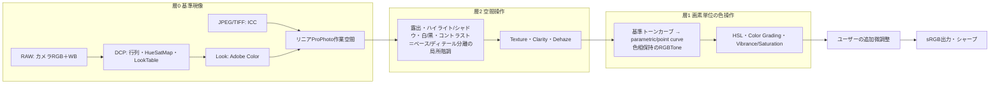

# 汎用XMP現像エンジン: 調査結果と実行計画

更新: 2026-09-22 JST（担当引き継ぎ後の再調査）。この文書が現行方針の正。[GENERIC_XMP_ENGINE.md](GENERIC_XMP_ENGINE.md)と[ENGINE_RESEARCH.md](ENGINE_RESEARCH.md)の調査を引き継ぎ、実測と追加調査で具体化した。

## 1. 結論

- **目標は変わらない。** どのLightroomプリセット（XMP）を登録しても、プリセット固有の調整なしに、共通の現像エンジンでLightroomと同じ見た目を得る。
- **Adobeの現像数式の大半は非公開で、無料で組み込めるAdobe製エンジンも存在しない。** 主要な競合製品も「基本補正だけ・近似」と明記しており、完全互換を達成した製品は確認できなかった。したがって「数式を推測する」のではなく、**Lightroomを教師にして操作（スライダー）ごとの応答を計測し、共通モデルへ落とす**方式を採る。プリセット単位の合わせ込みは行わない。
- エンジンは3層に分ける。**(0) 基準現像**は公開仕様（DNG仕様）とこのMacにあるAdobe標準プロファイルで再現する。**(1) 画素単位の色操作**はチャート計測でほぼ正確に同定できる。**(2) 空間的な操作**（ハイライト／シャドウ、テクスチャ等）は局所階調モデルを実写計測でfitする。残差が最後まで残るのは(2)。
- 今の「のっぺり・発色が弱い」の主因は実測で特定できた（§2）。彩度の調整不足ではなく、**階調圧縮を画面全体の1本のカーブで行っている構造**が原因。

## 2. 現状の実測

### 2.1 汎用経路の色差（前任者の測定値）

オーナー提供の3組（RAW／LR既定JPEG／LRでbluesky2適用JPEG）に対する平均CIEDE2000。出典は`.photobench/bluesky2-20260922/`の`production-v2-metrics.json`と`updated-four-values-metrics.json`。

| 経路 | 平均ΔE00 |
|---|---:|
| 汎用XMP経路・旧bluesky2（基本補正のみ） | 約13.6 |
| 汎用XMP経路・更新版bluesky2の値 | **17.4〜22.0** |
| 中止したbluesky2専用fit（v2） | 約6.6（p95は23） |

「同じ見た目」の目安は平均2以下・p95で5以下。現状の汎用経路は桁が違う。更新版XMPは露出+0.79／ハイライト−79／シャドウ+46／白レベル−56／黒レベル+90という強い値で、現行の`BasicToneModel`（目視で定数を置いた単調カーブ）が想定していない領域にある。

### 2.2 「のっぺり」の正体（今回の実測）

LRの「プリセット適用前JPEG → 適用後JPEG」から、明るさ別に **(a) 全体カーブの傾き** と **(b) 局所ディテールの保持率** を測った。画素単位の全体カーブだけで処理していれば(b)は(a)と一致する。スクリプトと結果は`.photobench/engine-research-20260922/local-contrast-evidence/`。

| シーン | 明るさ（白から何EV下か） | (a) 全体の傾き | (b) 局所ディテール保持 | (b)/(a) |
|---|---:|---:|---:|---:|
| P1013558 | −2.75 | 0.33 | 0.54 | 1.6倍 |
| P1013558 | −1.75 | 0.28 | 0.47 | 1.7倍 |
| P1013558 | −1.25 | 0.25 | 0.45 | 1.8倍 |
| P1013207 | −2.75 | 0.38 | 0.52 | 1.4倍 |
| P1013207 | −1.25 | 0.34 | 0.44 | 1.3倍 |

LRは中間〜明部を強く圧縮しながら、細部の明暗差を全体カーブの1.3〜1.8倍残している。これはAdobeがPV2012のハイライト／シャドウに用いているとされる局所ラプラシアンフィルタ系（エッジ保存型の局所階調処理）の挙動と整合する。**現行エンジンには空間処理が1つもない**ため、同じ全体の明るさに合わせるほど細部が平坦になる。前任者が彩度やオレンジ補正を足しても「くっきりしない」と言われ続けた理由はここにある。

### 2.3 基準現像の差

2026-07-24の観測で、プリセットを掛ける前のAs Shot同士でもLRと平均ΔE00で2.1〜3.7の差があった。現行はApple Core Image RAW（`boost 0.9`＝Appleのトーンカーブが9割掛かった状態）を土台にしており、Adobe Standard＋Adobe Colorとは別の絵作りである。

### 2.4 XMP項目の対応状況

オーナーの5プリセットが使う項目のうち、描画に接続済みなのは基本8項目の近似だけ。point curve／HSLは実験扱いで初期OFF。parametric curve、RGB別カーブの色処理、split toning／color grading、Camera Calibration（GreenHue等・全プリセットが使用）、Texture、Dehaze、絶対WB、シャープ／NR、レンズ補正、Look（Adobe Color）は未描画。

## 3. 調査で分かったこと

### 3.1 公開されているもの

- **カメラプロファイルの数式は完全公開。** DNG仕様1.7.1がColorMatrix／ForwardMatrixの光源補間、HueSatMap（リニアProPhotoのHSV空間）、LookTable、ProfileToneCurve、BaselineExposureを定義する。
- **Adobe DNG SDK**（無償・改変／配布可の許諾）に、その参照実装がある。`dng_render.cpp`の処理順、`RefBaselineHueSatMap`、**`RefBaselineRGBTone`（色相を保つトーンカーブ適用。ACR／LRの方式）**、ACR3既定トーンカーブ。RawTherapeeの"film-like"カーブも同じ方式だと文書化されている。
- XMPの項目名と型（Adobe XMP namespace）。Process Versionは11.0=PV5、15.4=PV6で、同じ設定値ならPV5とPV6の描画差は、カラーミキサーのバンディング修正を除きほぼ無いという実測報告がある。
- Texture＝中周波、Clarity＝より低周波、シャープ＝高周波という帯域の位置づけ（Adobe ACRチームの公式ブログ）。
- Camera Calibrationは「基準プロファイルそのものを変える唯一の操作で、他の全調整の下に効く」（Adobe社員の発言）。パイプライン順は固定で、スライダーを触った順には依存しない。

### 3.2 公開されていないもの

PV2012の基本補正（露出の肩、コントラスト、ハイライト／シャドウ／白／黒の式と画像適応）、HSL 8帯域の中心・幅・計算空間、Vibranceの重み、Color Gradingの式、Calibrationの行列、Texture／Clarity／Dehazeの式。信頼できる数式・実測データは見つからなかった。**ここは自分たちで計測するしかない。**

### 3.3 他製品・OSSの到達点

- darktableの`lightroom.c`はXMPの項目を自前モジュールへ写す近似で、コントラスト・Vibrance・Dehazeは扱わない。RawTherapee／ARTはDCPには対応するがLR現像設定の取り込みは無い。RapidRAW（Tauri製）もLRプリセット非対応。
- ON1、Luminar、Capture One、Photomator、Affinity等も、基本補正の近似のみ・プロファイル／LUT／局所コントラストは非対応と明記。**「任意のXMPでLRと同じ」を実現した製品は無い。** この目標は業界未解決の問題であり、完全一致ではなく「見比べて気づかない水準」を検証可能なゲートで定義する。
- プリセット→LUT変換ツール群（HALD方式）は、露出・コントラスト・ハイライト／シャドウ・Clarity・Texture・Dehaze・粒子等を表現できないと明記している。LUT 1枚では今回の問題は解けない。
- MITライセンスの`mini-film`に、AdobeのLook／プロファイルXMP内テーブル（独自base85＋zlib）のデコーダがある。

### 3.4 このMacで確認できた資産（今回の検証）

- Lightroom 9.3のアプリ内に**Adobe StandardのDCPが4,329本**あり、`Panasonic DC-S5 Adobe Standard.dcp`を含む（ColorMatrix1/2、ForwardMatrix1/2、HueSatMap 90×30×1、LookTable 36×8×16、トーンカーブ無し＝ACR既定カーブ）。
- 同じくアプリ内の`Adobe Color.xmp`のルックテーブルを**実際にデコードできた**（展開後110,616バイトのMD5がテーブルIDと一致。36×16×16のHSVルックテーブル＋ポイントカーブ）。
- LRが書いたサイドカーXMPから、オーナーのRAWに対するLRの基準状態が確定した: As Shot、Adobe Standard＋Adobe Color、PV 15.4、カメラ内蔵レンズ補正ON、シャープ40／半径1.0／ディテール25、カラーNR 25。
- サイドカーXMPが存在する＝LRの「ローカル」タブでXMPの読み書きが行われている。**XMPを機械生成してLRに読ませ、一括書き出しする教師データ量産**が成立する見込み（§6。最初に少数で往復確認する）。

**ライセンス上の注意:** DCPとAdobe ColorはAdobeの著作物。リポジトリ（公開）には入れない。オーナーのMacではLRの導入先から実行時に読む。NIHO Desktopで配布する場合は同梱できないため、無償のAdobe DNG Converterの導入先から読む方式（RawTherapeeと同じ慣行）か、自作プロファイルへのフォールバックを統合段階で決める。第三者ソフトによるプロファイル利用についてAdobeの明示的な許諾も禁止も確認できていない。

## 4. 方式の比較と採否

| 方式 | 任意プリセットへの汎用性 | LR再現性 | 費用 | 判断 |
|---|---|---|---|---|
| **A. 計測ベースの共通エンジン**（公開仕様＋操作別の計測モデル） | あり | 画素単位の操作は高い。空間操作は近似 | 無料 | **採用** |
| B. プリセットごとにLRでHALD画像を現像してLUT化 | 無い（新しいプリセットのたびにLRが必要） | 局所操作を表現できない | LR契約が必要 | 不採用。ただしHALDチャートは方式Aの計測手段として使う |
| C. 学習型（ニューラル）エミュレータ | あり | データ次第。破綻の検証が難しい | 無料だが教師データ数千枚規模 | 保留。方式Aで残る残差の補正候補 |
| D. Adobe公式API（Photoshop API v2） | あり | 本物 | Enterprise契約 | 費用条件により不採用 |
| E. Adobe DNG Converter（無償）の埋め込みプレビューを教師にする | — | 本物のACRエンジンの可能性 | 無料 | **未検証の実験候補。** XMPの現像設定がプレビューへ反映されるか確認できれば、LR解約後も使える自動の教師になる |

## 5. エンジン構造

- 図の順序は出発点の仮説。**実際の順序は計測で同定する**（操作A単独・B単独・A+Bの3つのLUTから、合成順を判定できる）。Calibrationは層0の内側に入る。
- 作業空間はACRと同じリニアProPhoto原色。Core Imageの作業空間（extended linear sRGB）は保ち、カーネル内で3×3変換する。
- モデルの係数・応答テーブルは**操作単位**で持つ。プリセット名・UUID・digest・写真名で分岐する処理は置かない。
- 層2は公開論文の枠組み（Fast Local Laplacian／ガイド付きベース・ディテール分離）を実装し、「ベースへ掛ける階調関数」「ディテール利得」「エッジ閾値」「輝度の符号化」をLR計測へfitする。
- 未対応の項目を含むプリセットは、読み込み時に「何が再現されないか」を表示する（既存の互換性表示を継続）。

## 6. 計測プロトコル（Lightroomを教師にする）

1. **往復確認（最初に1回・数分）**: 外部で書いたサイドカーXMP／埋め込みXMPを、LR 9.3のローカルタブが読むか。読まない場合はLR上の「設定のコピー＆ペースト」へ切り替える。
2. **チャート計測（層1）**: 16bit TIFFの合成チャート（HALD恒等、グレーランプ、色相スイープ）に、1操作だけ変えたXMPを埋め込んだファイルを数百枚生成する。LRで全選択→16bit TIFF・ProPhoto・出力シャープOFFで一括書き出し。各操作の応答、合成順、RAW／非RAWの差を同定する。
3. **実写計測（層2）**: 実写10〜15枚×操作別スイープ。RAWはAPFSクローン＋サイドカーで容量を増やさず複製する。画像適応の有無は、同じプローブ（グレーパッチ）を明るさ分布の違う写真へ埋め込んで測る。
4. **検証セット**: fitに使わない写真と、fitに使わないプリセット（オーナーの5本＋第三者の無料プリセット数本）で最終評価する。教師と検証を混ぜない。
5. 指標は平均／p95のCIEDE2000、平均EV差、明るさ帯ごとの局所コントラスト比、ハロー・クリップ。数値は入口で、最終判定はオーナーの目視。

オーナーの作業は「フォルダをLRで開く→全選択→書き出し」を3〜4回（各10分程度）。Claudeが画面操作で代行することも可能（その都度の許可が必要）。

### round0（準備済み・2026-09-22）

`scripts/lr_measure/make_round0.py`が`exports/lr-measure/round0/input/`へ30枚を生成した（RAWはAPFSクローン＋サイドカー20組、JPEG埋め込み7枚、TIFF埋め込み3枚）。手順は同フォルダの`README.md`。LR書き出し後に`scripts/lr_measure/analyze_round0.py`で次を判定する。

- A. 外部生成XMPをLRが読むか（彩度−100が白黒になるか）を、RAWサイドカー／JPEG埋め込み／TIFF埋め込みの別に確認
- B. サイドカーで全設定を与えた書き出しが、オーナーが手でbluesky2を当てた書き出しと一致するか（一致すればXMP機械生成による教師量産が成立）
- C. 更新版bluesky2を1操作ずつに分解した寄与（露出／コントラスト／ハイライト／シャドウ／白／黒／Texture／Vibrance／Saturation／parametric／point curve／HSL／split toning／Calibration／シャープ・NR）

生成時に分かったこと: **更新版bluesky2はシャープを40→0、カラーNRを25→0へ明示的に落としている。** LRが「くっきり」見える理由は既定シャープではなく、局所階調処理とTexture +12の側にある。

## 7. フェーズとゲート

| フェーズ | 内容 | 合格条件 |
|---|---|---|
| 0 | 前任作業のチェックポイントcommit、bluesky2専用補正コードの撤去、計測リグ（チャート生成・XMP生成・解析）とLR往復確認 | 往復が確認でき、リグが再現可能 |
| 1 | RAW基準現像: DCP＋Adobe Color＋ACR既定カーブ＋基準露出を仕様どおり実装。デコーダ（LibRaw／Core Image）は実測で決める | プリセット無しでLR既定と平均ΔE00 ≤ 2、平均EV差 ≤ 0.05 |
| 2 | 層1: カーブ、HSL、Calibration、Color Grading、Vibrance／Saturation、増分WB | 操作ごと・ランダム合成10組でチャート平均ΔE00 ≤ 1、p95 ≤ 2.5 |
| 3 | 層2: ハイライト／シャドウ／白／黒／露出の肩／コントラスト、続いてTexture／Clarity／Dehaze | 未使用の実写で平均 ≤ 2、p95 ≤ 5、局所コントラスト比±10%以内、ハロー無し |
| 4 | 既定シャープ／NR、レンズ補正の一致、周辺光量・粒子、プレビュー速度 | 100%表示で解像感がLRと同等、操作が実用速度 |
| 5 | 総合検証: 未使用プリセット×未使用写真でオーナーの見比べ | オーナーが普段使いできると判断 |
| 6 | NIHO Desktop統合（PhotoCoreをTauriから呼ぶ。プロファイル資産の扱いを決定） | — |

production実装はSonnet 5のサブエージェント、設計・計測設計・レビュー・文書は主担当。ゲートを満たさないフェーズは次へ進めない。各フェーズの所要は前フェーズの実測後に見積もり直す。現時点の見立ては、AI作業で延べ25〜45時間規模・複数セッション。最も不確実なのはフェーズ3。

### フェーズ1の事前検証（2026-09-22）

**仮説:** LRのプリセット無し現像は、公開仕様（DNG仕様／DNG SDKの処理順）と、このMacのLightroomにある`Panasonic DC-S5 Adobe Standard.dcp`＋`Adobe Color.xmp`だけで再現できる。

**方法:** LibRaw（`dcraw_emu`）でカメラRGBを取り出し、Pythonの試作で「ForwardMatrixの光源補間 → リニアProPhoto → HueSatMap → 基準露出 → DCP LookTable → Adobe Color LookTable → ACR3既定カーブ（色相保持のRGBTone）→ Adobe Colorのポイントカーブ → sRGB」を実装。オーナーの3枚のRAWについて、LRの既定書き出しJPEGと比較した。試作と数値は`.photobench/engine-research-20260922/dcp-base-prototype/`、比較画像は`exports/engine-research-20260922/`。

**結果（倍率を合わせた後、30×20領域の平均色で比較。CIEDE2000）:**

| シーン | DCP試作 平均／p95 | L*差 | 彩度比 | 現行Core Image土台 平均／p95 | L*差 | 彩度比 |
|---|---:|---:|---:|---:|---:|---:|
| P1013558 | **1.15** ／ 2.41 | +0.29 | 0.98 | 2.43 ／ 5.44 | +1.61 | 1.20 |
| P1013207 | **1.23** ／ 2.53 | +0.14 | 1.01 | 2.49 ／ 4.61 | +1.61 | 1.08 |
| P1012822 | **1.63** ／ 4.83 | +0.29 | 1.02 | 2.96 ／ 5.18 | +0.99 | 1.22 |

- **仮説は支持された。** 初回の試作でも、現行土台の約半分の誤差で、明るさ・彩度の系統的な偏りが無い。現行土台はLRより一貫して明るく（L* +1.0〜+1.6）、彩度が8〜22%高い。
- カメラ固有の基準露出（RW2には記録が無い未知数）を写真ごとに1変数でfitすると +0.058／+0.041／+0.071 EVで、ほぼ一定だった。カメラ定数として扱える。
- Adobe Colorのポイントカーブは「リニアProPhoto値へ色相保持のRGBToneで適用」が3枚とも最良。
- ルックテーブルのバイナリは、ヘッダu32×5（type, version, hue 36, sat 16, val 16）＋float32の`(hueShift, satScale, valScale)`＋末尾4バイト。彩度0の項目はvalScale=1.0で、DNG仕様と整合する。

**まだ差が残る要因:** レンズ歪曲・周辺光量補正が無い（LRはRW2内蔵の補正を適用。dcraw出力は約2.0〜2.5%広い。残差を中心／中間／周辺で分けると、3枚中2枚は周辺でも差が増えず、別レンズのP1012822だけ周辺が2.6。→ フェーズ4で対応）、ハイライトのクリップ処理の省略、Adobe Colorテーブルを1 floatずれて読んでいた試作側の不具合、8bit・縮小画像での比較。画素単位のゲート判定は幾何補正が揃ってから行い、それまでは領域平均で判定する（`scripts/lr_measure/compare_renders.py`）。

**Adobe Colorのポイントカーブの適用方法は未確定。** 試作3案の差は0.3 ΔE以内で位置ずれのノイズ以下。round0の`only-pointcurve`と、次回計測の「Adobe Standard（Look無し）」で確定する。フェーズ1の実装契約は[PHASE1_BASE_RENDERING.md](PHASE1_BASE_RENDERING.md)。

### フェーズ1の結果（2026-09-22、`ce91bfc`）

Swift実装（LibRaw 0.21.4 + Adobe Standard DCP + Adobe Color、CIColorCube 64³）をアプリと`photobench-render` CLIに接続し、ゲートに合格した。

| シーン | 新エンジン 平均／p95 ΔE00 | EV差 | 彩度比 | 旧Core Image土台 平均／p95 | EV差 | 彩度比 |
|---|---:|---:|---:|---:|---:|---:|
| P1013558 | **1.23** ／ 2.85 | −0.010 | 0.96 | 2.43 ／ 5.44 | +0.19 | 1.20 |
| P1013207 | **1.24** ／ 3.14 | −0.020 | 0.99 | 2.49 ／ 4.61 | +0.27 | 1.08 |
| P1012822 | **1.85** ／ 5.87 | −0.028 | 1.02 | 2.96 ／ 5.18 | +0.22 | 1.22 |

- 基準露出は **0** に確定。試作のfit値 +0.057 は試作側の不具合（ルックテーブルの読み違い・クランプ欠落）を吸収した値で、修正後の実装では +0.04〜0.05 EV 明るくなった。0にすると残差 −0.01〜−0.03 EV（位置ずれのノイズ内）。画素単位の比較ができるようになったら再fitする。
- GPU（cube）とCPU参照の最大ΔE 0.011。原寸デコード 1.7〜2.7秒、half-size 1.2秒、cube生成 約0.5秒（初回のみ。要最適化）。
- P1012822 の周辺（3.0）は周辺光量補正が無いため。比較画像は `exports/engine-research-20260922/phase1-base-rendering-review.jpg`。
- 残る差の主因は幾何（レンズ歪曲・周辺光量）と、Adobe Colorの点カーブ適用方法の未確定。

**デコーダの判断材料:** DCPの行列はカメラRGBへ掛けるので、Appleの色変換後しか取れないCore Image RAWでは仕様どおりに適用できない。色はLibRaw＋DCP経路、幾何（レンズ補正）はRW2内蔵データの自前適用が本線になる。Core Imageは比較基準と、DCPが無い機種のフォールバックとして残す。

試作を担当したサブエージェントの一次報告には誤りが3点あり（彩度過剰・現行土台の差27〜36・テーブルの並び）、主担当の再検証で訂正した。経緯は試作フォルダの`CORRECTION.md`。

### フェーズ2 計測の結果（2026-09-22、round0 / round1）

- **教師パイプラインが成立。** 機械生成XMPはRAWサイドカー／JPEG埋め込み／TIFF埋め込みのすべてでLRに読まれ、サイドカーで全設定を与えた書き出しは手動適用と完全一致（ΔE 0.000）。
- **チャートの色管理は標準ICC経路**（sRGB復号→Bradford→ProPhoto→ガンマ1.8）とp99で0.0003以内。ProPhoto HALDは色域境界の1.3%をLRがクリップ。
- **大域／空間の切り分け:** 露出・コントラスト・黒レベルは滑らかなランプとHALDで応答が一致（画素単位）。**ハイライト・シャドウは0.4〜0.9 EVも違う（空間処理）**。白レベルは0.05 EVの差（ほぼ大域）。→ ハイライト／シャドウ／Texture／Clarity／Dehazeはフェーズ3で実写から同定する。
- **カーブ系（ポイント／parametric／コントラスト）は「sRGB符号化空間でのRGBTone（色相保持）」が残差1/255 RMSで最良。** Refine Saturation 0 は輝度のみ系。
- **基準現像の確定:** Adobe Standard（Look無し）とAdobe Color（既定）を同時に満たすのは、DC-S5の基準露出 **−0.135 EV** ＋ Adobe Colorの点カーブを**sRGB符号化RGBTone**で適用、の組合せだけ（2プロファイル×3枚でEV −0.03〜0）。`4e8e342`で反映。
- **RAWの露出（Exposure2012）は、ルックテーブル・トーンカーブ前のリニア倍率で一致**（−1／+1／+2 EVでΔE 1.2〜1.4）。非RAW入力の露出は白点固定のロールオフ付きで別の式（同定中）。
- **Process Version 11.0 と 15.4 の同値描画差は平均ΔE 0.2〜0.5**（15.4を対象にする）。
- 非RAW入力への増分WB（IncrementalTemperature/Tint）はTIFFでは効果が見えなかった（要確認）。
- 更新版bluesky2の操作別寄与（LR既定比、平均ΔE）: 露出8.4、黒5.1、シャドウ4.7、ポイントカーブ4.4、ハイライト3.3、スプリットトーン2.7、白1.8、parametric 1.5、HSL 1.0、彩度0.8、Calibration 0.7。

操作ファミリー別の数式同定（tone / hsl / color）は `.photobench/phase2/<family>/model.md` に記録し、確定したものからSwiftへ移す。

### フェーズ2 C1 の結果（2026-09-22、`2df8f6a`）

露出（RAW: トーンカーブ前のリニア倍率）、絶対WB、コントラスト、白／黒、parametric、ポイントカーブを計測モデルで実装。P1013558 の単一操作ゲート（LR書き出し比、領域平均ΔE）: exposure 1.18 / contrast 1.21 / whites 1.33 / blacks 2.05（EV −0.16、クリップ側の課題）/ parametric 1.36 / pointcurve 1.56 / Temp4000 1.32 / Temp7500 1.52 / Tint+30 1.34 / neutral 1.22。基準現像（1.2）とほぼ同水準。

更新版bluesky2全体（HSL／彩度／グレーディング／Calibration／ハイライト／シャドウは旧近似のまま）: **5.03 / 7.10 / 6.55**（開始時 17〜22）。EV +0.17〜+0.36、彩度比 1.08〜1.37 で、残りは旧近似のハイライト／シャドウ（明るさ）と彩度系（C2／C3 で置換）。

### フェーズ2 C2 の結果（2026-09-22、`c1d274d`）

HSL（リニアRGBのHSV色相、8帯のcos²クロスフェード、彩度±で異なる式、輝度は帯別 (K,P,Q) 表）、Vibrance／Saturation（輝度不動点・色相保存のクロマ倍率。Vibrance は彩度・肌色保護）、Color Grading（輝度の山型重み＋色相方向＋既存彩度の保護）、Camera Calibration（リニアProPhotoの 3×3 行列）を `ColorOps` として実装し、fixture 26件×64色で Python 参照と相対 1e-4 で一致。順序は cube P（トーン）→ cube Q（Vibrance→Saturation→HSL→Grading）→ Calibration 行列。旧近似（`CIVibrance` / `CIColorControls` / OKLCh `PerceptualColorMixer`）は撤去。

実写ゲート（LR書き出し比、領域平均ΔE）: only-hsl 1.38 / only-saturation 1.27 / only-vibrance 1.30 / only-splittoning 1.33 / only-calibration 2.24 / SatOrange+60 1.40, 1.51 / LumBlue+60 1.33, 1.54 / GreenHue+50 1.99, 2.15 / BlueSat+50 2.57, 2.68。更新版 bluesky2 全体は **4.16 / 5.55 / 5.62**（C1 時点 5.03 / 7.10 / 6.55）、彩度比 0.93〜1.07。残りは旧近似のハイライト／シャドウ（EV +0.18〜+0.33）で C3 の対象。MidtoneLum / GlobalLum は未計測のため保持のみ。cube Q の生成は 610ms で要最適化。

### フェーズ2 C3 の結果（2026-09-23、`b70f123`）

Highlights2012 / Shadows2012 を `spatial-v2` の局所ラプラシアンモデルで実装（`SpatialToneOps` = CPU 参照、`SpatialToneProcessor` = Metal compute。fixture 14 ケースで Python と相対誤差 0.0、GPU/CPU 一致は最大 OKLab 距離 2e-7）。位置は cube P を P1（Contrast）→ S → P2（Whites 以降）に分割した間。旧近似 `BasicToneModel` は撤去。

実写ゲート（LR 書き出し比、領域平均 ΔE00、`scripts/lr_measure/run_gate.py`）:

| variant | P1013558 | P1013207 | P1012822 |
|---|---:|---:|---:|
| Highlights −100 | 3.51（EV −0.18） | 2.90（−0.11） | 3.11（−0.14） |
| Highlights −50 | 2.22 | 2.03 | 2.36 |
| Highlights +50 | 1.41 | 1.60 | 2.33 |
| Shadows +50 | 2.80（EV −0.17） | 1.71（+0.12） | 2.11（+0.05） |
| Shadows +100 | 4.59（EV −0.28） | 3.42（+0.28） | 3.33（+0.20） |
| Shadows −50 | 1.64 | 2.44 | 2.69 |
| tone-all_bluesky2 | 6.76（EV −0.45） | 4.96（−0.28） | 5.05（−0.26） |
| full_bluesky2 | 7.15（EV −0.45） | 4.67（−0.26） | 5.18（−0.28） |

- H/S 単体 12 ケース平均は **2.84**（参照実装単体の 2.08、ゲート 2.3 は未達）。ただし **参照実装（Python）を自前の中立レンダーに掛けても S+100 で 3.21 / 3.41 / 4.62、H−100 で 3.17 / 2.92 / 3.51** と Swift 出力（3.33 / 3.42 / 4.59、3.11 / 2.90 / 3.51）に一致するので、移植は忠実で、差は基準現像の残差（レンズ歪曲・周辺光量を含む。周辺領域で悪化）とモデル自体の残差。
- モデル自体の残差の性質: Shadows の効きがシーンによって逆符号（P1013558 は弱すぎ EV −0.28、他 2 枚は強すぎ +0.2〜0.28）で、参照実装を LR 中立 JPEG に掛けても同じ符号・大きさ（−0.285 / +0.29 / +0.21）。LR のシャドウは画像適応（ヒストグラム依存）と見られ、固定ゲイン表では吸収できない。ハイライト −100 は 3 枚とも 0.1〜0.18 EV 暗すぎる。
- bluesky2 全体は C2 時点（4.16 / 5.55 / 5.62、EV +0.17〜+0.36）から P1013207 / P1012822 は改善、P1013558 は悪化。EV は全 3 枚で −0.26〜−0.45 と暗く、H −79・Blacks +90・S +46 の個別の偏り（各ゲート内）が同符号で積み上がっている。6 スライダー同時の重ね合わせは `spatial-v2/model.md` §4 の未解決課題のまま。
- 次の改善候補（要 LR 追加書き出し）: (1) 複数スライダー同時のスイープ（H×S×Blacks の格子）で合成の偏りを切り分ける、(2) シャドウの画像適応成分（暗部の面積・ヒストグラム）を 10 枚以上の実写で fit、(3) 自前パイプラインの中立レンダーを入力にした再 fit。
- **実装形態の確定（`4062010`）**: 空間処理は `CIImageProcessorKernel` ではなく、入力を 1 回だけ Metal テクスチャへ描画して compute し `CIImage(mtlTexture:)` で返す明示的な GPU 往復。`CIImageProcessorKernel` は ROI を `.infinite` にすると cube 経由の入力で呼ばれず、有限にすると大画像で Core Image がタイル分割してタイルごとに入力全体を再描画するため（原寸 1 枚 10 分超）、どちらも不採用。原寸 render 463〜575ms、3072px でも約 370ms（Shadows の n_disc=10 × 各段のディスパッチ数による固定オーバーヘッド。バッチ化が次の最適化候補）。
- **レンズ歪曲補正込みの再計測（Mac Studio、`13b62f0` + `4062010`）**: H/S 18 ケース平均 **2.22**（≤ 2.3 達成）、コア 12 ケース 2.52。full_bluesky2 7.07 / 4.62 / 4.51。

### フェーズ3 Texture／Clarity／Dehaze の同定（2026-09-23、`.photobench/phase2/detail/`）

round1 の freq チャート（Texture±100、Clarity±100、Dehaze±50）と実写 3 枚（Texture±60、Clarity±60、Dehaze+40）から同定。参照実装 `detail_model.py`、詳細 `model.md`。

- **Texture / Clarity2012**: log2 輝度の Burt–Adelson ピラミッドの各段に **段別の線形ゲイン**（実写 3 枚の最小二乗、9 段）を掛けるモデル（Model L）。局所ラプラシアン型（Model N）も fit したが実写 ΔE で上回れず約 9 倍重いため不採用。Texture は既定 5 段（scale_px 32）、Clarity は実測でより広帯域なので **+3 段**。輝度のみに効く（R/G/B 比を保持）。amount は ±60 実測から線形外挿（(gain−1)·amount/60）。
- **Dehaze**: 空間成分（dark channel 系）は実写で改善せず**不採用**。大域トーンカーブ（log2 輝度、29 点表、amount/50）＋彩度倍率（k = 1 + 0.4693·amount/40、色相保持）のみ。負側の彩度は未計測の外挿。
- 到達点（画素 ΔE00 mean、1500×1000）: Texture±60 0.67〜1.31、Clarity±60 1.34〜3.40、Dehaze+40 2.63〜4.26。15 ケース平均 **1.93**（大域のみ 2.33、何もしない 2.15）。Dehaze はシーン非依存の固定カーブなのでヘイズの少ない P1013207 では「何もしない」に負ける。
- 合成順序は round0 の資産では検証できず未決着。暫定は「トーンカーブ後・ハイライト／シャドウ直後・Texture → Clarity → Dehaze」。
- 追加計測が有効な XMP: Texture／Clarity／Dehaze の ±20／±40／±80（線形性）、Dehaze −40（彩度負側）、明部限定チャートの Clarity±60（明るさ依存）。

### フェーズ3 C4 の結果（2026-09-23、`8c1569f`）と、合成時の暗さの切り分け

Texture / Clarity2012（Laplacian 段別線形ゲイン、Clarity は +3 段）と Dehaze（pointwise の大域カーブ＋彩度倍率、cube に焼く）を実装。fixture は Python 参照と相対誤差 0.0、GPU/CPU 一致は最大 OKLab 距離 0.0037。実写ゲート（Studio、領域平均 ΔE）: Texture±60 0.95〜1.29、Clarity−60 1.21〜1.63、Clarity+60 4.06 / 2.60 / 2.18、Dehaze+40 3.29 / 5.19 / 4.21、**15 ケース平均 2.18**（≤ 2.3）。

一方、4 プリセット × 2 scene（RAW P1524180、JPEG DSC02072）は C2 時点より悪化し、8 組すべてが **一様に暗い**（EV −0.24〜−0.58、L* −4〜−13。RAW: bluesky2 4.19 / night 9.78 / pastel 3.90 / colorful 6.53、JPEG: 4.90 / 10.43 / 5.62 / 7.59。C2 時点は RAW 2.44 / 7.45 / 5.47 / 4.44、JPEG 2.71 / 5.29 / 1.63 / 1.89）。

原因の切り分け（round0 の **JPEG 入力**は LR と幾何・基準現像が同一なので、モデルの誤差だけが出る。`.photobench/phase2/nonraw-gate/`）:

| 変種（JPEG 入力、P1013558） | 平均ΔE | EV | chroma |
|---|---:|---:|---:|
| only-highlights（−79） | 1.88 | −0.10 | 0.93 |
| only-shadows（+46） | 1.57 | −0.15 | 0.95 |
| only-blacks（+90） | 0.81 | −0.02 | 0.89 |
| tone-all | 6.19 | −0.38 | 0.71 |
| LR 中立の再書き出し vs 入力（LR 自身の no-op 残差） | 0.09 | 0.00 | 1.00 |

- ハイライトは 3 scene とも我々が暗い（H−100 で −0.11〜−0.18 EV）＝**モデルの効きが強すぎる**。シャドウは写真によって強すぎ／弱すぎ（LR の画像適応）。両者と Blacks の偏りが同符号で積み上がり、tone-all で −0.38 EV になる。合成順序の問題ではなく、単体の振幅の問題が主。
- 対応中: (1) 空間処理の位置の切替実験（Contrast 前／後、点カーブ後、トーンカーブ前、出力参照の最後）、(2) ゲイン表の振幅 4 係数（H±、S±）を実写 20 ケースで再フィット（spatial-v2.1）、(3) 4 プリセットの残差分解（色相帯・トーン別）。結果は本節に追記する。

**空間処理の位置の切替実験（2026-09-23、`6b9ae9d`、`PHOTO_BENCH_SPATIAL_ORDER`）**: Studio で 5 つの位置を同じケース群で比較（平均 ΔE / EV）。

| 位置 | H/S 単体 12 | tone-all 3 | full 3 | RAW プリセット 4 | JPEG プリセット 4 | 非RAW round0 4 |
|---|---:|---:|---:|---:|---:|---:|
| p1-s-p2（現行: Contrast → S → Whites…） | 2.22 / −0.04 | 5.42 / −0.33 | 5.39 / −0.33 | 6.10 / −0.35 | 7.13 / −0.42 | 2.61 / −0.16 |
| s-p1-p2（S → Contrast …） | 2.22 / −0.04 | 5.45 / −0.33 | 5.42 / −0.33 | 6.22 / −0.36 | **5.82 / −0.33** | **1.99 / −0.11** |
| p1-p2-s（点カーブの後） | 2.22 | 6.77 / −0.44 | 9.37 / −0.59 | 8.76 / −0.54 | 9.62 / −0.61 | 2.94 / −0.19 |
| pre-tone（RAW: Stage E 後・Look/Tone 前のリニア） | 3.55 / +0.08 | **2.53 / −0.02** | **2.74 / −0.03** | **3.30 / −0.08** | 7.28 / −0.43 | 2.63 / −0.16 |
| post-q（cube Q・Calibration の後） | 2.22 | 6.77 / −0.44 | 9.16 / −0.60 | 8.89 / −0.55 | 9.52 / −0.61 | 2.94 / −0.19 |

- RAW は **トーンカーブ前のリニア領域**に置くと合成の暗さがほぼ消える（tone-all −0.33 → −0.02 EV）。単体 12 ケースは 2.22 → 3.55 に悪化するが、これはゲイン表を出力参照で fit したままのため（振幅の再フィットで回復を狙う）。`spatial-v2/model.md` §5 の「後が良い」は基礎誤差の大きい試作パイプライン上の 4 ケース比較で、確信度は再評価が必要。
- 非RAW は **露出・コントラストの前**（入力リニア）が最良で、non-RAW tone-all 6.19 → 3.68。RAW と合わせて「トーン系の前」で一貫する。
- 点カーブの後・出力参照の最後は明確に悪い。
- 次: RAW=pre-tone、非RAW=s-p1-p2 を固定して、ゲイン表の振幅係数（kH、kS）と Calibration の順序（cube Q の前）を実エンジンの格子探索で決める（学習: 単体 12 + tone-all 3 + 非RAW 3、ホールドアウト: full 3 + 4 プリセット × 2 scene）。

**4 プリセットの残差分解（2026-09-23、`.photobench/phase5/preset-residuals/model.md`）**: 4 プリセット × 11 操作グループの中立化 XMP（48 種）を RAW / JPEG で 104 枚描画し、LR 参照と比較。

- 共通の 1 位は **C3 の Highlights／Shadows**（確定）: 8 組中 7 組で「外すと改善」し、改善幅は |Highlights2012| にほぼ比例（colorful −88 / night −87 で最大、pastel −44 で最小）。RAW では中間調（相対輝度 0.33〜0.56）で EV 誤差がピーク。→ 振幅の再フィット（spatial-v2.1）が対処。
- **night の 2 位は Calibration の適用順**（確定）: 外すと 1.75 / 1.35 改善。`color/model.md`・`hsl/model.md` の同定は Calibration → Vibrance/Saturation → HSL → Grading だが、実装は Calibration を cube Q の **後**（出力参照の最後）に置いている。night は HSL 8 帯すべてが稼働するため順序依存の影響が最大。→ 出力参照の位置は保ったまま、cube Q の **先頭**（Vibrance の前）に移す変更を検証する。
- night の絶対 WB（6214K / +13）は正しく機能している（As Shot に戻すと 9.35 → 20.25 に激悪化）。
- night の有彩画素の 99% を占める Red/Orange（肌・木床）で chroma 比 0.65〜0.76、色相 −11〜−15° のドリフト。bluesky2 は Blue/Aqua 帯で +8〜+42°、colorful は Blue/Purple で −7° の色相ドリフト（`hsl/model.md` の既知の弱点: LuminanceAdjustmentBlue が 48 変種中最悪、スライダー線形性未検証）。
- 次の計測案: P1524180 / DSC02072 のプリセット無し LR 書き出し、night の H/S 個別 ablation、Calibration 順序入れ替えの再検証、Hue 系スライダーの多点実写。

### フェーズ4 レンズ補正の調査（2026-09-23、`.photobench/phase4/lens/`）

- **歪曲は確定。** LR は RW2 埋め込みの補正（`LensProfileSetup=LensDefaults`、`LensProfileIsEmbedded=True`）を使っており、ExifTool `PanasonicRaw.pm` の式 `Ru = scale·(Rd + a·Rd³ + b·Rd⁵ + c·Rd⁷)` に、IFD0 タグ 0x0119（DistortionInfo、int16×16）の `scale = 1/(1+data[5]/32768)`、`a = data[8]/32768`、`b = data[4]/32768`、`c = data[11]/32768`、正規化半径 **`R0 = data[12]`（DistortionN、DC-S5 は 3605 = 6000×4000 の半対角）** を入れると、自由パラメータ 0 個で LR との格子点対応が RMS 0.42〜0.63 px（Sigma 50/1.4 と Lumix S 35/1.8）。中心は画像の幾何中心、接線成分なし。
- 出力キャンバスはカメラ宣言の有効域（CropLeft/Top/Right/Bottom = 12/8/6012/4008 → 6000×4000）で、LibRaw 出力（6024×4016）と中心が一致する。「自前が 2.0〜2.5% 広い」は `DistortionScale`（平均 +2.25%）そのもの。
- 効果（プリセット無し、`--no-align`、領域平均 ΔE00）: 2.96 / 3.94 / 3.43 → **0.93 / 1.06 / 1.22**。画素 ΔE00 も 6.8〜12.8 → 1.6〜2.2。
- **周辺光量は同定できず**（MakerNote に数表が無く、実写 3 枚では場面のムラが信号を上回る）。グレーカード等の平坦な素材か同一レンズの多数枚が必要。色収差は LR も補正していない（AutoLateralCA=0）。

旧校正契約（`calibration/*.json`、7月の manifest）は歴史的証跡として変更しない。関連テスト9件は OS固定条件と processing fingerprint の変更で失敗する既知事項。フェーズ4/5 で契約を新ゲートへ置き換えて整理する。

## 8. リスクと見通し

- **完全一致は約束できない。** 層2はAdobe非公開の画像適応処理で、極端な設定（オーナーのプリセットはまさにそれ）ほど差が残りやすい。到達点はゲートの数値と目視で判断する。
- LRのローカルタブが外部XMPの変更を再読込しない可能性がある（コミュニティ報告）。§6-1で最初に確認する。
- macOS 27でCore Image RAW 9（ML型デモザイク）が入る。Core Imageを土台にした機種別fitは動く標的になるため、色はDCP経路へ寄せる。
- 教師データを作れるのはLR契約中だけ。フェーズ2〜3の計測と、検証用の書き出しを契約中に済ませる。方式Eが成立すればこの制約は外れる。
- Adobeのプロファイル資産の第三者利用・配布は未確定（§3.4）。オーナー個人のMacでの利用と、NIHO配布は分けて判断する。

## 9. 主な出典

- DNG仕様1.7.1／Adobe DNG SDK 1.7.1（`dng_render.cpp`、`dng_reference.cpp`、`dng_color_spec.cpp`、`dng_hue_sat_map.cpp`）
- [Local Laplacian Filters (SIGGRAPH 2011)](https://people.csail.mit.edu/sparis/publi/2011/siggraph/Paris_11_Local_Laplacian_Filters.pdf)、[Fast Local Laplacian Filters (TOG 2014)](https://jankautz.com/publications/FastLLF_TOG14.pdf)、[Adobe Research掲載](https://research.adobe.com/publication/local-laplacian-filters-edge-aware-image-processing-with-a-laplacian-pyramid/)
- [Adobe: Process versions](https://helpx.adobe.com/camera-raw/using/process-versions.html)、[ACRチーム: Texture](https://theblog.adobe.com/from-the-acr-team-introducing-the-texture-control/)、[調整順とCalibration（Adobe社員）](https://www.lightroomqueen.com/community/threads/does-the-order-of-adjustments-in-develop-matter.10971/)、[Refine Saturation](https://helpx.adobe.com/lightroom-cc/using/whats-new/2023-4.html)
- [darktable lightroom.c](https://github.com/darktable-org/darktable/blob/master/src/develop/lightroom.c)、[RawPedia: Color Management](https://rawpedia.rawtherapee.com/Color_Management)、[DCamProf](https://rawtherapee.com/mirror/dcamprof/dcamprof.html)、[mini-film (MIT)](https://github.com/alfanick/mini-film)、[PassXMP (MIT)](https://github.com/maxthomason/PassXMP)
- [LRローカルタブの挙動（Lightroom Queen）](https://www.lightroomqueen.com/community/threads/question-about-locals-tab.49085/)、[HDRNet](https://arxiv.org/abs/1707.02880)、[Image-Adaptive 3D LUT](https://github.com/HuiZeng/Image-Adaptive-3DLUT)、[MIT-Adobe FiveK](https://data.csail.mit.edu/graphics/fivek/)
- [LibRaw ライセンス](https://www.libraw.org/about)、[Apple WWDC21: RAWのlinear出力](https://developer.apple.com/videos/play/wwdc2021/10160/)、[Apple WWDC26: RAW 9](https://developer.apple.com/videos/play/wwdc2026/305/)
