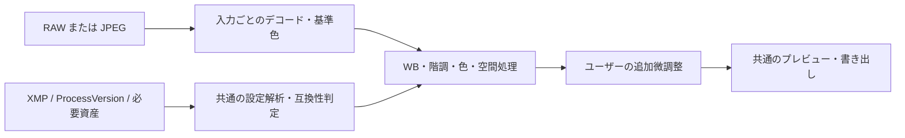

# 汎用XMP現像エンジンへの方針修正

更新: 2026-09-22 JST。設計・調査記録。汎用互換が実装済みという意味ではない。

> 同日の再調査で、方式の採否・エンジン構造・計測プロトコル・フェーズとゲートを[ENGINE_ROADMAP.md](ENGINE_ROADMAP.md)へ具体化した。現行方針の正はそちら。この文書は要件と棚卸しの記録として残す。

## 要件

オーナーの再確認により、必要なのは「任意のLightroomプリセットをXMPから読み込み、共通の現像処理でLightroomと同様の色・発色を得ること」。特定のプリセットや3枚の教師画像だけに合わせる方式は採用しない。NIHO Desktopへ組み込める編集機能を目指す。

主担当は、bluesky2の専用係数を3組の写真から作り、orangeの後段補正を加える方向へ進めてしまった。この方式は要件を満たさない。v4の局所コントラスト追加は中止。専用補正の新規自動適用を外し、過去の保存済み編集の再現だけを互換目的で保持する。日常編集の登録・Undo・自動保存・JPEG書き出しは継続利用する。

## 現状の棚卸し

根拠: `XMPPresetParser.swift`、`EditSettings.swift`、`RenderEngine.swift`、`EditorModel.renderSettings`。5つの手元XMPの項目抽出はprivateの`.photobench/bluesky2-20260922/generic-xmp-audit.json`。

| 項目 | 現状 | 共通モデルで必要なこと |
|---|---|---|
| RAWの出発点・カメラプロファイル | Core Image RAW 8、DC-S5用の既存デコード設定。Adobeのプロファイル適用ではない | RAWの基準色、WB、カメラ別色変換、プロファイル・版依存を分離して検証 |
| 露出・Contrast・Highlights・Shadows・Whites・Blacks | 数値を読むが、独自の近似式 | 各操作の応答と、複数操作の相互作用を共通の式で検証 |
| Temperature / Tint / 増分WB | 値の解析・保持のみ。XMPのWBは描画未接続 | RAW絶対WB、As Shot、JPEG増分値を区別して接続・検証。既存の手動相対スライダーとは別の意味 |
| Vibrance / Saturation | Core Imageによる近似 | 色空間・低彩度・肌・強い色の応答を検証 |
| Point curve / 8色HSL | 独自近似。通常UIは初期OFF | 色空間、曲線補間、HSL帯域と輝度の意味を検証して接続 |
| Parametric curve | 未描画 | Split値を含む共通演算 |
| Split toning / Color grading / Camera calibration | 未描画 | 色空間、明暗域、Balance / Blending、順序を含む演算 |
| Texture / Clarity / Dehaze / detail | 未描画 | XMP値に応じる空間処理。プリセット固定値の追加は禁止 |
| CameraProfile / Look / lens等の外部資産 | 未適用 | 必要な資産・版を解決。欠落を正しく扱う |
| マスク・Auto・適応型設定等 | 一般互換なし | 個別に要件と実装方式を調査。未対応を黙って無視して「対応済み」にしない |

bluesky2更新XMPには基本8項目以外に、24 HSL値、7 parametric値、14 grading値等もある。項目数には0や恒等値を含むため、これをそのまま欠落効果数とは扱わない。

## 採用可能な方式と費用条件

### A. Adobe非依存の共通ローカルエンジン

- XMPの意味を正規化して共通の編集パラメータへ変換する。
- プリセット名・UUID・digest・写真名・位置を色処理の分岐に使わない。
- 処理は入力種別、カメラ、色空間、ProcessVersion、実際のXMP設定・必要資産で決まる。
- Adobe互換は操作別と未使用の写真・プリセットで検証する。共通式の係数調整は可能だが、特定プリセット専用の係数保存へ戻さない。
- 任意のプリセット・将来の設定を含めた完全一致は現時点で保証できない。3枚の見た目だけでは完成判定できない。

### B. Adobeの現像機能を利用

AdobeはPhotoshop API v2 `/v2/edit`にXMP presetと現像操作をまとめている。旧Lightroom APIは2026-07-31 EOLとして案内されているため、新規方式として旧APIへ依存しない。これはAdobe公式処理を利用する候補だが、RAW形式、ProcessVersion、外部プロファイル、マスク等を含む実際の互換範囲・商用利用・費用は別途確認が必要。デスクトップと全条件で同じ出力になるという保証をここではしない。[Adobe V2仕様](https://developer.adobe.com/firefly-services/docs/photoshop/guides/photoshop-v2/v1-to-v2/v2-api-catalog)、[終了案内](https://developer.adobe.com/firefly-services/docs/lightroom/getting-started/deprecation-announcement/)

ローカル側ではLightroom Classic SDKがプラグイン・書き出し拡張を提供する。SDKはLightroomを拡張するもので、Photo Benchへ独立した現像エンジンをそのまま組み込めるという資料ではない。Classic本体への依存を許容する場合の候補として扱う。[Adobe Classic SDK](https://developer.adobe.com/lightroom-classic/)

写真のアップロード、外部サービス契約、Lightroomのカタログ変更は実施していない。オーナーから「無料のAdobeエンジンなら利用可、月額が必要なら独自開発」と回答を得た。公式資料・SDKソースを調査し、[現像エンジン調査](ENGINE_RESEARCH.md)に比較と推奨構成を記録した。恒久無料が確認できないAdobe APIを採用せず、無料のRAW/色処理部品を使うローカル構成を優先する。

## 共通エンジンの設計契約案

実際の演算順は検証対象で、この図だけでAdobeの処理順が確定したとは扱わない。XMPは設定名・値を記録する仕組みであり、公開Camera Raw namespaceの記述から各演算の内部式を得られるわけではない。ProcessVersionによって描画技術・操作も変わる。[XMP namespace](https://developer.adobe.com/xmp/docs/xmp-namespaces/crs/)、[Process versions](https://helpx.adobe.com/camera-raw/desktop/get-started/overview-and-setup/process-versions.html)

## 検証の組み直し

1. RAWとJPEGを分け、同じ入力・WB・profile・crop・出力色空間・処理版で基準を固定する。RAW由来のLR JPEGとカメラJPEGを同一視しない。
2. LRの基準状態から1操作だけを変えた複数の設定値を用意し、操作の応答を測る。現状のプリセット適用前後3組だけで全演算を特定しない。
3. まず共通WB・基本階調・point/parametric curve・HSLの順に、未知写真で効果が再現されるか判断する。対象設定の順は基準色の調査結果で調整する。
4. 操作の組合せを検証し、4プリセットに加えて**実装調整に使っていないプリセット**を評価する。同じ3組へのfit/評価を汎化の証拠にしない。
5. 数値の平均色差だけでなく、色域別の差・黒つぶれ・白飛び・木目/肌/緑・halo・プレビューと書き出し一致を確認する。
6. 未対応の効果・外部資産を含む場合は、その事実を適用前に表示する。読み込み成功と描画互換を分ける。

検証用データの作成手順は、方式選択後にまとめて依頼する。オーナーへ少しずつ色の感想だけを求める進め方に戻さない。

## 作業量の扱い

今回の要件は、特定の色調整を数時間続ける作業ではなく、共通の現像エンジンの実装・互換性検証である。従来の「3時間程度」の見立てをそのまま当てはめない。方式、必要な設定の範囲、基準出力の取得方法を決め、操作別の最初の再現性検証で工数を見積もり直す。
